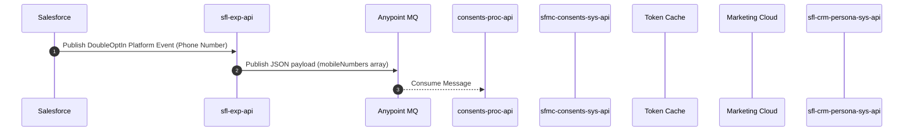

# Design: Insulet Double Opt-In SMS Integration
Notebook: Insulet DoubleOptIn
Extracted: 2026-05-18

---

## Business Use Case

Insulet requires a double opt-in process for their transactional SMS messages to prevent cell carriers from blacklisting their Marketing Cloud Short Code. While there is not a legal requirement for a double opt-in for Transactional SMS, it is very strongly advised (borderline mandatory) that they implement it from a technical perspective. When a patient's consent status updates to "Opt In Pending" in Salesforce, it triggers a workflow to send an initial text message asking the user to confirm their consent by replying "YES". To achieve this smoothly, the integration's purpose is to connect Salesforce with Salesforce Marketing Cloud (SFMC) using an event-driven, API-led MuleSoft architecture. This integration captures a Salesforce platform event containing the user's phone number, processes it asynchronously through an Anypoint message queue, and ultimately executes an SFMC REST API call to queue and dispatch the outgoing opt-in text message.

---

## Integration Pattern & Data Flow

The Double Opt-In solution utilizes an event-driven, API-led architecture to move data from Salesforce to Marketing Cloud, passing through several MuleSoft APIs and a message queue.

### Flow Overview

1. **Salesforce (Source)**: Publishes a `DoubleOptIn` Platform Event containing the patient's phone number.
2. **sfl-exp-api (Experience Layer)**: Listens to the platform event, transforms the phone number into a single-element JSON array (`mobileNumbers`), and publishes it to the downstream message queue.
3. **Anypoint MQ (Message Broker)**: Holds the JSON payloads in the `<env>-sfl-doubleoptin-sfmc-mq` queue for asynchronous processing.
4. **consents-proc-api (Process Layer)**: Consumes the message from the Anypoint MQ and orchestrates the call to the downstream System API. In the event of an error, it calls the `sfl-crm-persona-sys-api` to log the failure in Salesforce.
5. **sfmc-consents-sys-api (System Layer)**: Receives the request from the Process API, authenticates with Marketing Cloud using a cached bearer token, and pushes the request to Marketing Cloud.
6. **Salesforce Marketing Cloud Classic (Downstream)**: Receives the API request from the System API and queues the outbound MO (Mobile Originated) SMS message to the patient.
7. **sfl-crm-persona-sys-api (System Layer)**: Acts as the error-logging system for the Double Opt-In flow. It writes `Integration_Error__c` records directly back to Salesforce Core.

### Integration Endpoints & Field Mappings

#### 1. `sfl-exp-api` (Experience API)
- **Endpoint**: `SUBSCRIBE` to Salesforce `DoubleOptIn` Platform Event
- **Target Downstream System**: Anypoint MQ (`<env>-sfl-doubleoptin-sfmc-mq`)
- **Field Mapping**:
  - `Phone_Number_c` (String from SF Platform Event) → `mobileNumbers` (Array of Strings)
  - Logic: Maps the single incoming phone number string into a single-element JSON array

#### 2. `consents-proc-api` (Process API)
- **Endpoint**: Consumes from Anypoint MQ (`<env>-sfl-doubleoptin-sfmc-mq`)
- **Target Downstream Endpoints**:
  - Primary: `POST /consents/opt-ins` on `sfmc-consents-sys-api`
  - Error Logging: `POST /transactions-errors` on `sfl-crm-persona-sys-api`
- **Field Mapping**:
  - `payload.mobileNumbers` (Array of Strings from MQ) → `mobileNumbers` (Array of Strings)

#### 3. `sfmc-consents-sys-api` (System API)
- **Endpoint**: `POST /consents/opt-ins`
- **Target Downstream SFMC Endpoints**:
  - Auth: `POST https://<YOUR_SUBDOMAIN>.auth.marketingcloudapis.com/v2/token`
  - SMS Queue: `POST /sms/v1/queueMO/`
- **Field Mappings to SFMC Auth Request**:
  - `"client_credentials"` (hardcoded) → `grant_type`
  - Injected secure property → `client_id`
  - Injected secure property → `client_secret`
  - Injected secure property → `account_id` (the MID)
- **Field Mappings to SFMC SMS Queue Request**:
  - `payload.mobileNumbers` (Array of Strings) → `mobileNumbers`
  - Injected environment property → `shortCode` (e.g., `99236` for UAT or `69566` for PROD)
  - Injected environment property → `messageText` (standardized to `"JOIN"`)

#### 4. `sfl-crm-persona-sys-api` (System API — Error Logging)
- **Endpoint**: `POST /transactions-errors`
- **Target Downstream System**: Salesforce Core via Salesforce Connector (`Integration_Error__c` object)
- **Field Mappings**:

| API Input | SF Target Field | Type | Mandatory |
|---|---|---|---|
| `muleAppName` | `Mule_App_Name__c` | String | Yes |
| `correlationId` | `Correlation_ID__c` | String | Yes |
| `errorTimestamp` | `Error_Timestamp__c` | Datetime | Yes |
| `errorMessage` | `Error_Message__c` | String | Yes |
| `payloadData` | `Payload_Data__c` | String | No |
| `responseData` | `Response_Data__c` | String | No |
| `errorType` | `ErrorType__c` | String | No |
| `apiVersion` | `API_Version__c` | String | No |
| `externalReferenceId` | `External_Reference_ID__c` | String | No |
| `resolvedFlag` | `Resolved_Flag__c` | Boolean | No |
| `transactionId` | `Transaction_Id__c` | String | No |
| `sourceSystem` | `Source_System__c` | String | No |
| `transactionType` | `Transaction_Type__c` | String | No |

---

## Downstream Systems

| System | Role | Type |
|---|---|---|
| Salesforce Core (Lightning/Infinity) | Source — publishes `DoubleOptIn` Platform Event when consent status = `OptInPending` | Source |
| Anypoint MQ (`<env>-sfl-doubleoptin-sfmc-mq`) | Asynchronous message broker decoupling Experience API from Process API | Middleware |
| Salesforce Marketing Cloud Classic | Target — queues outbound MO SMS to patient via `/sms/v1/queueMO/` | Destination |
| sfl-crm-persona-sys-api | Error sink — writes `Integration_Error__c` records to Salesforce on downstream failures | Error Logging |
| SFMC Auth endpoint (`/v2/token`) | Authentication — issues Bearer tokens (20-min TTL) for SFMC API calls | Auth |

---

## Business Rules & Validations

### Business Rules

- **Double Opt-In Technical Requirement**: While there is no strict legal requirement for a double opt-in for Transactional SMS, it is strongly advised and borderline mandatory as a technical requirement to prevent Insulet's Short Code from being blacklisted by cell carriers.
- **Consent Triggers**: A double opt-in text message must be triggered when:
  - A Patient Lead is created in Lightning (after R1 go-live)
  - A patient's consent status is updated to "Opt In Pending" (contact point type consent `PrivacyConsentStatus = OptInPending`)
  - A Contact Point Phone (CPP) is newly created with `IsPrimary = true` AND `UsageType = Mobile`
  - A CPP is updated and the `IsPrimary` flag is updated
  - A CPP is updated and `UsageType` is changed to "Mobile"
- **Consent Confirmation**: If a recipient responds "YES" or "Y" to the initial text, Marketing Cloud sends a confirmation message and updates all matching Salesforce patient records' `SMS_Consent_Status__c` to "Opt-In". Redundantly, when the double opt-in SMS is successfully sent, MC writes "Not Yet Consented" back to `Patient__c.SMS_Consent_Status__c`.
- **Opt-Out Process**: Users can opt out only by texting "STOP" from their end. This triggers a confirmation message, updates their Mobile Connect status, and updates `Patient__c.SMS_Consent_Status__c` to "Opt-Out" for all Patients sharing the same phone number.
- **Agent Restrictions**: Agents in Salesforce Lightning are ONLY allowed to change the Transactional SMS CPTC records' status from any other value to "Opt In Pending". Agents are explicitly NOT allowed to manually opt patients out from within Salesforce.
- **Double Opt-In Message Counter**: A backend integer counter (`DoubleOptInMessageCounter`) on the CPTC of type SMS must be incremented when `PrivacyConsentStatus` is updated to `PendingOptIn`, or when the related Contact Point Phone (`UsageType = Mobile`) is updated to `IsPrimary`.
- **Scope of Sync**: Only Transactional SMS CPTC records are considered for this opt-in logic.
- **Task Creation for SMS**: When a text message is successfully sent, Marketing Cloud inserts a Completed Task titled "Patient Outreach" (created by MC Admin user) into Salesforce Classic. These Tasks must be synchronized to Lightning via Org Sync.

### Field Validations

| Field | Rule |
|---|---|
| `patientDOB` | Must strictly follow `YYYY-MM-DD` format |
| Phone numbers passed to SFMC | Must be formatted as an 11-digit string for NA, including the leading "1" (e.g., `17742581354`) |
| Phone number in platform event | Must not contain any spaces or special characters (e.g., `13233276476`) |
| `providerAccountId`, `practiceAccountId` | Must be valid Salesforce Account IDs (if provided) |
| `facilityId` | Must be a valid Salesforce ID (if provided) |
| `providerLeadId` | Must be a valid Salesforce Lead ID (if provided) |
| `PUT /patients/leads` identifiers | At least one of `leadId` or `legacyID` must be provided |
| `mobileNumbers` array | Mandatory — Array of Strings — for System API and MQ payload |
| Error logging mandatory fields | `muleAppName`, `correlationId`, `errorTimestamp`, `errorMessage` |

---

## Error Handling

### Global Error Framework
All APIs must utilize the Insulet Parent-POM and standard libraries, including the Common Error Handler, Notification Connector, and Common Logger, to catch, log, and gracefully route exceptions. All credentials must be injected via Azure Vault Keys.

### Process API Error Logging (`consents-proc-api`)
If the `consents-proc-api` encounters an HTTP error (e.g., 400 Bad Request, 500 Internal Server Error) or a timeout from the SFMC System API:
1. The global error handler intercepts the failure
2. DataWeave constructs an error payload following the `Integration_Error__c` schema
3. An HTTP POST request is executed to `sfl-crm-persona-sys-api` at `/transactions-errors`
4. Once the error is **successfully logged**, the API ACKs the original MQ message

### Poison-Message Looping Prevention
The Anypoint MQ Connector must be configured with **Manual Acknowledgment** (Confluence page for `consents-proc-api` specifies Manual ACK with Circuit Breaker). Messages are only removed from the queue (ACKed) after a successful handoff to SFMC OR after an error is successfully logged in Salesforce.

**Circuit Breaker Configuration** (per Confluence `consents-proc-api`):
- Configure built-in Circuit Breaker on the Anypoint MQ Listener
- Define `onErrorTypes` (e.g., `HTTP:TIMEOUT`, `HTTP:SERVICE_UNAVAILABLE`, `HTTP:TOO_MANY_REQUESTS`)
- `errorsThreshold`: e.g., 5 errors
- `tripTimeout`: e.g., 5 minutes

### HTTP Status Code Reference

| Status | Reason | Trigger |
|---|---|---|
| 200 OK | Success | Successful handoff to SFMC (`sfmc-consents-sys-api`) |
| 201 Created | Success | Lead created, IndividualId retrieved (`sfl-crm-persona-sys-api POST /patients/leads`) |
| 400 Bad Request | Invalid Input | Missing mandatory fields (e.g., `lastName`, `mobileNumbers`) or malformed JSON |
| 404 Not Found | Record Not Found | Identifier did not match any existing record; DataWeave must explicitly route empty payloads to 404 |
| 500 Internal Server Error | System Error | SFMC connectivity issues, Auth Token failure, invalid SOQL, or unexpected runtime exception |

### Experience API (`sfl-exp-api`)
Because the `sfl-exp-api` is an asynchronous event-driven flow subscribing to Salesforce Platform Events, it does not return HTTP status codes back to the client. System errors (dropped connectivity, mapping failures) must be caught globally to trigger the Common Error Handler.

---

## Briefing Document

### Key Architectural Decisions

- **API-Led, Event-Driven Architecture**: The integration uses MuleSoft API-led approach (Experience, Process, System layers) and is strictly event-driven, relying on Anypoint MQ to decouple systems and ensure asynchronous processing.
- **Salesforce Platform Events**: Instead of direct API callouts from Salesforce, Salesforce triggers a `DoubleOptIn` Platform Event when a patient's SMS consent requires a double opt-in.
- **SFMC Token Caching**: SFMC issues Bearer tokens that live for exactly 20 minutes. To optimize performance and prevent rate-limiting, the MuleSoft System API uses an Object Store cache with a strict TTL of 18-19 minutes — ensuring the token expires in Mule just before it expires in SFMC, preventing HTTP 401 Unauthorized errors.
- **Reusable Authentication Subflow**: The SFMC caching and authentication logic is encapsulated in a dedicated, reusable Mule Subflow (`sfmc-auth-token-subflow`). Future APIs requiring SFMC access can reference this subflow without duplicating complex caching logic.
- **Manual Acknowledgment with Circuit Breaker**: Messages are ACKed only after full transaction completion (either success or logged error). The built-in Anypoint MQ Circuit Breaker prevents endless retry loops on persistent downstream failures.
- **Selected Approach — Option 2**: MuleSoft invokes Marketing Cloud Classic API. This approach adheres to Insulet's MuleSoft-focused integration design and results in the least amount of throwaway work (MuleSoft service can switch from Classic to Infinity Marketing Cloud for R2).

### Open Questions

- **Data Sync for One-Way SMS**: Which exact field(s) in Classic `Patient_Campaign_Association__c` records are used to track one-way SMS activities (needed for Org Sync to synchronize CampaignMembers from Lightning to Classic)?
- **"Invalid Mobile Number" Status**: When exactly is `Patient__c.SMS_Consent_Status__c` updated to "Invalid Mobile Number", and does this originate exclusively from Classic Marketing Cloud?
- **ASPN SMS Opt-Out Process**: If a `Consent__c` record of type "ASPN SMS" is updated to "Opt Out", should agents manually remind customers to text "STOP" to opt out? (Confirmation needed with Tara.)

### Risks

| Risk | Mitigation |
|---|---|
| **Short Code Blacklisting** — Failure to implement double opt-in risks cell carriers blacklisting Insulet's short code | Implement double opt-in as a mandatory technical requirement |
| **Double-Triggering Platform Events** — Concurrent `PrivacyConsentStatus` and `CPP.IsPrimary` updates may trigger the event twice | Use static variable `Set<Id> patientAccountIds` in Apex service class to prevent duplicate event generation |
| **Poison Messages in Anypoint MQ** — If downstream SFMC connectivity drops, failed messages could accumulate | Global error handler in Process API intercepts failures, logs to Salesforce via `/transactions-errors`, then ACKs message; Circuit Breaker trips after threshold |
| **MuleSoft Team Capacity** — Limited bandwidth for R1 | Option 2 chosen as it minimizes throwaway work and reuses existing MuleSoft patterns |

### Recommended Implementation Approach

1. **Salesforce**: Create `DoubleOptIn` Platform Event. Implement Apex triggers on `ContactPointPhone` and `ContactPointTypeConsent` objects. Use static variable `Set<Id> patientAccountIds` to prevent double-triggering. Phone number format: `<countrycode><phone>` without spaces (e.g., `13233276476`).
2. **sfl-exp-api**: Configure Salesforce Connector Subscribe Channel Listener. Transform phone number string to `{"mobileNumbers": ["..."]}` array. Publish to `<env>-sfl-doubleoptin-sfmc-mq`. Log success via Common Logger.
3. **consents-proc-api**: Subscribe to Anypoint MQ with Manual ACK + Circuit Breaker. Execute HTTP POST to `sfmc-consents-sys-api POST /consents/opt-ins`. On success, ACK message. On error (400/500/timeout): transform error payload, call `sfl-crm-persona-sys-api POST /transactions-errors`, then ACK.
4. **sfmc-consents-sys-api**: Check Object Store for cached Bearer token (TTL 18-19 min). If expired, call SFMC `/v2/token`. Inject `shortCode` (`99236` UAT, `69566` PROD) and `messageText` (`"JOIN"`) from environment properties. POST to SFMC `queueMO`. Return `{"status": "Success"}` on 200 OK.

---

## Study Guide

### Key Concepts

- **Double Opt-In for Transactional SMS**: While not a strict legal requirement, Insulet strongly advises this as borderline mandatory to prevent their short codes from being blacklisted by cellular carriers. When a patient's consent status changes to "Opt In Pending", the system triggers an initial SMS asking them to reply "YES" to confirm consent.
- **API-Led Connectivity Architecture**:
  - Experience Layer: Captures the initial Salesforce platform event (`sfl-exp-api`)
  - Process Layer: Retrieves messages from queue and dictates business logic (`consents-proc-api`)
  - System Layer: Wraps backend systems (Salesforce CRM and Marketing Cloud) (`sfmc-consents-sys-api`, `sfl-crm-persona-sys-api`)
- **Asynchronous Message Queuing**: The Experience API publishes to `<env>-sfl-doubleoptin-sfmc-mq` to decouple Salesforce from Marketing Cloud. The Process API consumes this queue.
- **Poison-Message Looping Prevention**: Messages are only ACKed after a successful HTTP 200 from Marketing Cloud OR after an error is successfully logged in Salesforce.
- **Token Caching**: SFMC bearer tokens live for exactly 20 minutes. Mule uses an Object Store with TTL of 18-19 minutes to prevent rate limits and `401 Unauthorized` errors.
- **DataWeave Priority Logic**: For `PUT /patients/leads`, DataWeave dynamically evaluates `leadId` vs `legacyID` (priority: `leadId > legacyID`), switching between standard Update or Upsert accordingly.

### Definitions

| Term | Definition |
|---|---|
| `sfl-exp-api` | Salesforce Experience API — entry point from Salesforce, subscribes to `DoubleOptIn` platform event, publishes to Anypoint MQ |
| `consents-proc-api` | Process API — listens to Anypoint MQ, orchestrates SFMC call, routes errors to Salesforce logger |
| `sfmc-consents-sys-api` | SFMC Consents System API — direct wrapper for SFMC REST API, manages token caching, pushes to `/sms/v1/queueMO/` |
| `sfl-crm-persona-sys-api` | SF Leads System API — creates/updates Patient/Provider Leads, queries facilities, logs `Integration_Error__c` records |
| `Integration_Error__c` | Custom Salesforce object used by `/transactions-errors` to centralize integration failure logging |
| `CampaignMember` | Standard Salesforce Lightning object for tracking one-way SMS campaigns; allows only 1 record per patient/campaign combo |
| `CPTC` | Contact Point Type Consent — Salesforce object tracking patient's privacy consent status (e.g., `OptInPending`) |
| `CPP` | Contact Point Phone — Salesforce object tracking phone number and usage type (e.g., Mobile) |

### Acronyms

| Acronym | Meaning |
|---|---|
| SFMC | Salesforce Marketing Cloud |
| MQ | Message Queue (Anypoint MQ) |
| CPTC | Contact Point Type Consent |
| CPP | Contact Point Phone |
| TTL | Time-To-Live (token cache: 18-19 min; RecordType cache: 30 days) |
| ACK | Acknowledgment (confirms message processed and removes from queue) |
| MO | Mobile Originated (outbound SMS message type) |
| MID | Marketing Cloud Account ID |

### Open Questions & Edge Cases

- **Duplicate Platform Events**: If a Salesforce user updates CPP so that `IsPrimary` becomes True AND `UsageType` changes to "Mobile" simultaneously, the Apex trigger risks publishing the platform event twice. Use static variable `Set<Id> patientAccountIds` to prevent this.
- **Manual Opt-Outs**: Agents are ONLY allowed to change Transactional SMS status to "Opt In Pending". To opt out, the patient themselves must text "STOP".
- **Missing Field Mappings**: For `POST /patients/leads`, target field `OwnerId` is listed in requirements but omitted from input mapping — likely determined contextually or defaulted in Salesforce.
- **SMS Not Configured for EU**: The SMS opt-in is built only for NA UAT and PROD SFMC environments. SMS is NOT configured for the EU org.

---

## FAQ

**Q: What is the overall architecture for the Double Opt-In SMS integration?**

A: The solution uses an event-driven, 3-layer API-led MuleSoft architecture. Salesforce publishes a `DoubleOptIn` platform event containing a patient's phone number. The Experience API (`sfl-exp-api`) listens for this event, transforms the phone number into a `mobileNumbers` JSON array, and publishes it to an Anypoint MQ. The Process API (`consents-proc-api`) consumes this message and orchestrates an HTTP POST request to the SFMC System API (`sfmc-consents-sys-api`), which authenticates and queues the message in Marketing Cloud.

---

**Q: How does authentication with Salesforce Marketing Cloud (SFMC) work?**

A: The preferred method is using bearer tokens. The `sfmc-consents-sys-api` calls the SFMC Auth endpoint (`POST https://<YOUR_SUBDOMAIN>.auth.marketingcloudapis.com/v2/token`) with `grant_type="client_credentials"`, `client_id`, `client_secret`, and `account_id` (the MID) — all injected from secure Azure Vault properties.

---

**Q: How do I cache the SFMC token to prevent 401 Unauthorized errors?**

A: A successfully retrieved token lives for exactly 20 minutes. The requesting Mule platform must retain this token in an Object Store/Cache scope with a TTL of 18-19 minutes. This guarantees the token expires in the Mule cache just before it officially expires on the SFMC server. Encapsulate this entire process into a dedicated, reusable Mule Subflow (e.g., `sfmc-auth-token-subflow`).

---

**Q: What is the exact payload and endpoint required to queue the SMS in SFMC?**

A: The `sfmc-consents-sys-api` makes an HTTP POST to `/sms/v1/queueMO/` with Bearer token in `Authorization` header. Required payload:
```json
{
  "mobileNumbers": ["17742581354"],
  "shortCode": "99236",
  "messageText": "JOIN"
}
```
`shortCode` and `messageText` are injected from environment properties — not from API input.

---

**Q: How are integration errors handled and logged in Salesforce?**

A: In `consents-proc-api`, if an HTTP error (400/500) or timeout occurs when calling SFMC, the global error handler intercepts the failure. DataWeave constructs an error payload and executes an HTTP POST to `sfl-crm-persona-sys-api` at `/transactions-errors`, which creates an `Integration_Error__c` record in Salesforce.

---

**Q: How does the Process API prevent "poison-message looping" in Anypoint MQ?**

A: The Anypoint MQ Connector in `consents-proc-api` is configured with Manual Acknowledgment and a Circuit Breaker. The API ACKs the message only after either: (a) a successful HTTP 200 from SFMC, or (b) the error is successfully logged in Salesforce via `sfl-crm-persona-sys-api`. This prevents endless retry loops for failed messages.

---

**Q: Do I need to implement Circuit Breakers, Spike Control, or Rate-Limiting?**

A: Spike Control and Rate-Limiting SLAs are marked "No" across all APIs. A Circuit Breaker IS configured on the Anypoint MQ listener in `consents-proc-api` (per the Confluence documentation) with `errorsThreshold` and `tripTimeout` settings to prevent persistent downstream failures from looping.

---

**Q: How do we prevent duplicate platform events from being fired from Salesforce triggers?**

A: If a Contact Point Phone is updated so that `IsPrimary` becomes True AND `UsageType` changes to "Mobile" simultaneously, the Apex trigger may fire twice. Use a Static Variable `Set<Id> patientAccountIds` in the Apex service class to check conditions before sending the platform event. This approach has been approved.

---

**Q: Which Marketing Cloud environments are fully configured for SMS Opt-In?**

A: The SMS opt-in is built in SFMC for the North America (NA) UAT and PROD environments only. SMS is not configured for the EU org.

---

## Diagram Sources

### Diagram: Double Opt-In Integration Sequence diagram



### Diagram: Double Opt-In Integration Flow Diagram (PlantUML)


---

## Jira / Confluence References

### Jira Story IDs

| Story ID | Title | Status |
|---|---|---|
| NGASIM-28 | Epic: Capture Transaction SMS, Transactional Email & Marketing Email Patient and Provider Consents | — |
| NGASIM-3058 | Send SMS Opt In request to Marketing Cloud through Mulsoft | Done |
| NGASIM-3143 | [DoubleOptIn] Mulesoft - SMS Opt In request to MC - sfmc-consents-sys-api | Technical Refinement |
| NGASIM-3249 | Technical Documentation Sub-task | Done |
| NGASIM-3250 | Unit Testing Sub-task | Done |
| NGASIM-3251 | Peer Review Sub-task | Done |
| NGASIM-3252 | PR Review Sub-task | Done |
| NGASIM-3253 | Dev Sub-task | Done |
| NGASIM-3254 | Deployment Sub-task | Done |
| NGASIM-3335 | [DoubleOptIn] Mulesoft - SMS Opt In request to MC - consents-proc-api | Technical Refinement |
| NGASIM-3336 | [DoubleOptIn] Mulesoft - SMS Opt In request to MC - sfl-exp-api | Technical Refinement |
| NGASIM-3384 | Test Case Creation Sub-task | Done |
| NGASIM-3385 | Test Case Review and Approvals Sub-task | Done |
| NGASIM-3386 | Test Case Execution Sub-task | Done |

### Confluence Page URLs

- `https://confluence.prod.insulet.com/wiki/spaces/Mule/pages/412221441/sfmc-consents-sys-api`
- `https://confluence.prod.insulet.com/wiki/spaces/NASFL/pages/135182451/SMS+Consent+Double+Opt-In+One-Way+SMS+Solution+Design#Option-1:-Classic-invokes-Marketing-Cloud-API`
- `https://confluence.prod.insulet.com/wiki/spaces/Mule/pages/417136774/consents-proc-api`
- `https://confluence.prod.insulet.com/wiki/spaces/Mule/pages/139433148/sfl-exp-api`

---

## Confluence Pages

### Page: sfmc-consents-sys-api (412221441)
Source: https://confluence.prod.insulet.com/wiki/spaces/Mule/pages/412221441/sfmc-consents-sys-api

Application Technical Name: sfmc-consents-sys-api
Application Business Name: SF Marketing Cloud Consents System API
Business Domain: consents
Available Versions: 1.0
Purpose of API: Update consents
Mule Application Type: API
API Type: system
Healthcheck Endpoints: GET /health-check, GET /ping

Authentication: Client ID / Client Secret
Spike Control: No
Rate-Limiting SLA: No

Insulet Connectors/Libraries Used: Parent-POM, Common Error Handler, Notification Connector, Common Logger

Resources: POST /consents/opt-ins
Input: `mobileNumbers` (Array of Strings, Mandatory)

Backend Mapping and Logic: Direct API Wrapper Logic — calls SFMC Auth endpoint first to obtain a Bearer token, which is then used to queue the MO (Mobile Originated) message. Authentication uses a cache/Object Store with TTL slightly less than 20 minutes (18-19 min). The reusable sfmc-auth-token-subflow encapsulates the entire caching process. SFMC Request: passes `mobileNumbers` directly to `/sms/v1/queueMO/`, with `shortCode` and `messageText` injected from environment properties.

References:
- SMS Consent Double Opt-In & One-Way SMS Solution Design
- Marketing Cloud Classic Envs: API endpoints for MC environments
- Marketing Cloud Classic Auth

---

### Page: SMS Consent Double Opt-In & One-Way SMS Solution Design (135182451)
Source: https://confluence.prod.insulet.com/wiki/spaces/NASFL/pages/135182451/SMS+Consent+Double+Opt-In+One-Way+SMS+Solution+Design

Background: As part of Infinity R1, the Classic Marketing Cloud SMS Short Code (intended for Transactional SMS) will need to stay within Classic, to send out text messages for onboarding, Discover and other things. While there is not a legal requirement for a double opt-in for Transactional SMS, it is very strongly advised (borderline mandatory) that we implement it from a technical perspective, so as to not risk our Short Code being blacklisted by the cell carriers. Note that the term "Transactional SMS" here is the Insulet definition, which is broader than the industry standard.

Functional Need: When a Patient Lead gets created in Lightning after R1 go-live, we need to ensure that a double opt-in text message gets sent out to the phone number on file, and all IS/FS one-way SMS get sent out to patients as expected. "One-way SMS" actually means limited two-way — the patient could choose to respond to these text messages, and that response should come back and be visible to IS.

Current Classic Behavior — Double Opt In:
- Given a `Blank_PIF_Staging__c` record: If its `SMS_Pre_Opt_In__c` field is true, then set SMS Consent Status to "Not Yet Consented" and trigger an outbound API call to Marketing Cloud to send the double opt-in message.
- Given a Patient, if they update their Phone Number in Podder Central: And If their existing SMS Consent Status is not already "Opt-In", then set SMS Consent Status to "Pending Consent" and trigger an outbound API call to Marketing Cloud to send the double opt-in message.
- Marketing Cloud also writes "Not Yet Consented" back to the `Patient__c.SMS_Consent_Status__c` Field when a double opt-in text message is successfully sent out.
- Once the user responds with "Yes", Marketing Cloud updates the corresponding Patient record's SMS Consent Status to "Opt-In".

Opt Out: As of 1/22/2026, the only way is for the person to text STOP from their end, upon which: (1) the user gets the confirmation message, (2) the Mobile Connect status gets updated, and (3) MC updates `Patient__c.SMS_Consent_Status__c` to "Opt-Out" for all Patients with the same matching phone number.

Selected Architecture Option: **Option 2 — MuleSoft invokes Marketing Cloud Classic API**.
- Adheres to Insulet's MuleSoft-focused integration design
- Least amount of throwaway work (MuleSoft service can switch from Classic to Infinity Marketing Cloud for R2)
- SF Core publishes a Platform Event on ContactPointTypeConsent when PrivacyConsentStatus changes to OptInPending and ContactPointPhone when IsPrimary flag is updated
- MuleSoft makes API call-out to MC

---

### Page: consents-proc-api (417136774)
Source: https://confluence.prod.insulet.com/wiki/spaces/Mule/pages/417136774/consents-proc-api

Application Technical Name: consents-proc-api
Application Business Name: Consents Process API
Business Domain: Consents
Available Versions: 1.0
Purpose of API: Event-driven API to listen to double opt-in messages from MQ and orchestrate the request to Salesforce Marketing Cloud.
Mule Application Type: API
API Type: Process
Healthcheck Endpoints: GET /health-check, GET /ping

Authentication: Client ID Enforcement (For Healthchecks/Admin endpoints)
Response Time: N/A (Asynchronous processing)
Spike Control: No
Rate-Limiting SLA: No

Depends on: sfmc-consents-sys-api, sfl-crm-persona-sys-api
Libraries: Parent-POM, Common Error Handler, Notification Connector, Common Logger
Other Connectors: Anypoint MQ Connector, HTTP Request Connector

MQ Listener: `<env>-sfl-doubleoptin-sfmc-mq`
Input: `mobileNumbers` (Array of Strings, Mandatory) — formatted as 11-digit string for NA including leading 1

Backend Mapping and Logic:
- Message Consumption: Manual Acknowledgment with built-in Circuit Breaker
- Circuit Breaker: Configure `onErrorTypes` (HTTP:TIMEOUT, HTTP:SERVICE_UNAVAILABLE, HTTP:TOO_MANY_REQUESTS), `errorsThreshold` (e.g., 5 errors), `tripTimeout` (e.g., 5 minutes)
- On success: ACK message after HTTP 200 from `sfmc-consents-sys-api`
- On error: Global error handler catches, DataWeave constructs error payload, POST to `sfl-crm-persona-sys-api /transactions-errors`, then ACK

---

### Page: sfl-consents-exp-api / sfl-exp-api (139433148)
Source: https://confluence.prod.insulet.com/wiki/spaces/Mule/pages/139433148/sfl-exp-api

Application Technical Name: sfl-exp-api
Application Business Name: Salesforce Experience API
Business Domain: Consents
Available Versions: 1.0
Purpose of API: Listen to SF Platform Event for SMS Double Opt-In and insert the message into Anypoint MQ `<env>-sfl-doubleoptin-sfmc-mq`.
Mule Application Type: API
API Type: Experience
Healthcheck Endpoints: GET /health-check, GET /ping

Authentication: Client ID Enforcement (For Healthchecks/Admin endpoints)
Response Time: N/A (Asynchronous processing)
Spike Control: No
Rate-Limiting SLA: No

Libraries: Parent-POM, Common Error Handler, Notification Connector, Common Logger
Other Connectors: Salesforce Connector (Platform Event Listener), Anypoint MQ Connector

Resource: DoubleOptIn Event — SUBSCRIBE (Salesforce Connector Config — Listen to DoubleOptIn platform events from Salesforce)
Input Field: `Phone_Number_c` (String, Mandatory)

Backend Mapping and Logic: Publish to MQ. The listener will capture the event containing the Phone Number and complete the processing by inserting the message into Anypoint MQ `<env>-sfl-doubleoptin-sfmc-mq` for the `consents-proc-api` to consume.

| Salesforce Input Field | Target MQ Payload Field | Mapping Logic |
|---|---|---|
| `Phone_Number_c` | `mobileNumbers` (Array) | Map the incoming Phone Number string from the platform event into a single-element JSON array |

---

## Source Summaries

### Source: Double Opt-In Integration Flow Diagram (PlantUML)
**Keywords**: Double Opt-In, Integration Flow Diagram, PlantUML, Anypoint MQ, Salesforce Marketing Cloud

This source provides the technical blueprint for a Double Opt-In Integration Flow, structured as a swimlane activity diagram (PlantUML) to visualize how user data moves across different platforms. By defining specific swimlanes, the text categorizes the distinct roles of Salesforce, Experience API, Anypoint MQ, Process API, SFMC System API, Marketing Cloud, and CRM Persona System API. The diagram serves as a structural guide for developers to understand the interconnected API layers and data pathways required to confirm a subscriber's consent.

---

### Source: Double Opt-In Integration Sequence diagram
**Keywords**: Sequence diagram, Double Opt-In, Salesforce integration, Anypoint MQ, Marketing Cloud

This technical diagram illustrates a sophisticated data flow designed to manage customer communication preferences across multiple enterprise platforms. Using a decoupled architecture, the system triggers a sequence where contact information moves from Salesforce through an Experience API and into a message queuing service for asynchronous processing. The primary objective is to facilitate a Double Opt-In procedure, ensuring that user consent is verified and synchronized between core CRM databases and Marketing Cloud environments.

---

### Source: DoubleOptIn-APIled.pdf
**Keywords**: Double Opt-In, API-led Connectivity, Salesforce Marketing Cloud, Address Validation, Consent Management

This document illustrates an API-led connectivity architecture designed to manage data flow between different integrated systems. It utilizes a three-tiered structure (system, process, experience APIs) to facilitate specialized tasks like address validation and consent management. By leveraging HTTP/REST protocols, the framework connects various platforms, specifically highlighting the integration between MuleSoft and Salesforce Marketing Cloud.

---

### Source: MC-API connections for external systems
**Keywords**: Marketing Cloud APIs, Integration Authorization, API Entry Events, Transactional Send Journeys, Triggered Send Definitions

This document serves as a technical guide for establishing API connections between external systems and Salesforce Marketing Cloud, emphasizing the necessity of a shared authentication process for all integrations. The text outlines three primary methods for triggering communications, identifying Journeys with API entry events as the most versatile and recommended choice due to their robust multi-channel capabilities.

---

### Source: MC-API endpoints for MC environments
**Keywords**: API endpoint configuration, Environment variables, Marketing Cloud integration, Client secret security, API setup process

This technical guide outlines the procedures and configurations required to establish API integrations within Salesforce Marketing Cloud across different geographical regions and business stages. It details a standardized API setup process using a server-to-server approach, providing specific environment variables (Client IDs, unique subdomains) necessary to connect AWS, Drupal, and SFDC to REST and SOAP endpoints.

---

### Source: MC-Auth
**Keywords**: Access authorization, Bearer tokens, API request, Client credentials, Token lifespan

This documentation outlines the standardized process for securing API access within Salesforce Marketing Cloud using a bearer token system. A client must submit a POST request containing client ID, secret, and account ID to a designated authentication endpoint. The system grants an access token that remains functional for a twenty-minute duration. Developers are encouraged to store and reuse these tokens locally for the duration of their lifespan.

---

### Source: MC-SMS opt-in
**Keywords**: SMS opt-in process, API development, Patient record updates, SFMC configuration, Subscriber consent status

This technical guide outlines the automated SMS opt-in workflow within Salesforce Marketing Cloud for North American environments. The process triggers a double opt-in message to patients, updating their consent status in Salesforce based on their text response. Developers can initiate these requests via API calls using either specific subscriber keys or just mobile phone numbers, provided they include a valid authentication token. The SMS opt-in is built for NA UAT and PROD environments only — SMS is not configured for EU.

---

### Source: Mule-consents-proc-api.pdf
**Keywords**: MuleSoft API, Process API, Consent Management, API Implementation, Data Integration

The provided document outlines a technical framework for managing user consent and data privacy through a specialized process-level API that bridges the gap between raw data storage and complex business logic. By standardizing how permissions are recorded and updated, the system provides a centralized mechanism for tracking consumer preferences across multiple platforms.

---

### Source: Mule-sfl-crm-persona-sys-api.pdf
**Keywords**: Salesforce System API, Lead Data Mapping, API Endpoint Specifications, Backend Integration Logic, MUNIT Coverage Testing

This technical document outlines the specifications for the SF Leads System API, a MuleSoft-based application designed to manage and synchronize patient and healthcare provider leads within Salesforce. The interface facilitates critical business operations such as creating and updating lead records, querying facility locations, and logging integration errors for troubleshooting. The system utilizes Client ID Enforcement for authentication and demonstrates 95% MUNIT test coverage for its core connectivity and processing flows.

---

### Source: Mule-sfl-exp-api.pdf
**Keywords**: Salesforce Experience API, Anypoint MQ Integration, Double Opt-In Events, Data Mapping Logic, Mule Application Architecture

The Salesforce Experience API serves as a specialized integration bridge designed to manage user communication preferences within the consents business domain. Functioning as an asynchronous listener, the application monitors Salesforce Platform Events for SMS double opt-in triggers and captures incoming phone numbers. Once an event is detected, the API transforms the data into a specific JSON format and transfers it to Anypoint MQ.

---

### Source: Mule-sfmc-consents-sys-api.pdf
**Keywords**: Mule System API, SFMC Consent Management, Token Caching Mechanism, API Payload Mapping, HTTP Status Codes

The sfmc-consents-sys-api is a specialized MuleSoft system API designed to facilitate user permissions by updating opt-in consents within the Salesforce Marketing Cloud platform. It functions as a direct API wrapper, exposing a specific endpoint to manage campaign memberships while handling the technical complexities of SMS queueing and message formatting. A critical feature is a reusable subflow for authentication using an Object Store caching mechanism to manage Bearer tokens efficiently.

---

### Source: NASFL-SMS Consent Double Opt-In & One-Way SMS Solution Design
**Keywords**: SMS Double Opt-In, Marketing Cloud API, Technical Solution Design, Salesforce Org Sync, SMS Consent Management

This technical design document outlines the strategy for integrating SMS consent and messaging within a transition from a legacy Salesforce "Classic" environment to a new "Infinity" platform. The primary objective is to maintain a double opt-in process for transactional texts to ensure compliance and protect the company's messaging reputation with cell carriers. After evaluating several architectural paths, the proposal highlights a preference for MuleSoft-driven integration to balance team capacity with long-term scalability.

---

### Source: [#NGASIM-3058] Send SMS Opt In request to Marketing Cloud through Mulsoft
**Keywords**: SMS Opt In, Mulesoft Integration, Marketing Cloud, Salesforce Platform Events, Consent Status Tracking

This document details a completed technical task within the NextGen CRM ASIM project aimed at automating SMS marketing consent between Salesforce and Marketing Cloud. The primary objective was to develop a platform event that triggers whenever a patient's mobile contact status is updated to OptInPending, ensuring this data is seamlessly transmitted via Mulesoft middleware. Key requirements included formatting phone numbers without spaces and implementing a static variable approach to prevent duplicate events.

---

### Source: [#NGASIM-3143] [DoubleOptIn] Mulesoft - SMS Opt In request to MC - sfmc-consents-sys-api
**Keywords**: SMS Double Opt-In, Mulesoft API Integration, Salesforce Marketing Cloud, Technical Design RAML, Token Authentication Caching

This technical document outlines the integration story for `sfmc-consents-sys-api`. The primary purpose is to allow the MuleSoft platform to receive mobile numbers and securely transmit them to Salesforce Marketing Cloud to trigger patient consent requests. The solution emphasizes a caching mechanism for authentication tokens and strict adherence to RAML specifications for data validation.

---

### Source: [#NGASIM-3335] [DoubleOptIn] Mulesoft - SMS Opt In request to MC - consents-proc-api
**Keywords**: SMS Opt In, Mulesoft API Integration, Anypoint MQ, Salesforce Marketing Cloud, Global Error Handling

This technical document outlines the development of `consents-proc-api`. The core workflow involves an event-driven architecture where the system retrieves mobile phone data from an Anypoint MQ queue and pushes it to a downstream system API for record creation. The design incorporates auto-acknowledgment to confirm successful transactions and a global error handler that logs failures directly into Salesforce.

---

### Source: [#NGASIM-3336] [DoubleOptIn] Mulesoft - SMS Opt In request to MC - sfl-exp-api
**Keywords**: SMS Double Opt-In, Salesforce Integration, MuleSoft API Implementation, Anypoint MQ Publishing, Error Handling Logic

This technical document outlines the MuleSoft integration story for `sfl-exp-api`. The primary objective is to listen for patient consent events triggered in Salesforce and securely transmit that data to an Anypoint MQ for downstream processing. Key technical requirements include using DataWeave to transform simple phone number strings into specialized JSON arrays and implementing a global error handler to manage connectivity failures. Because this system operates as an asynchronous event-driven flow, it focuses on reliable message delivery and logging rather than immediate feedback to the source client.
