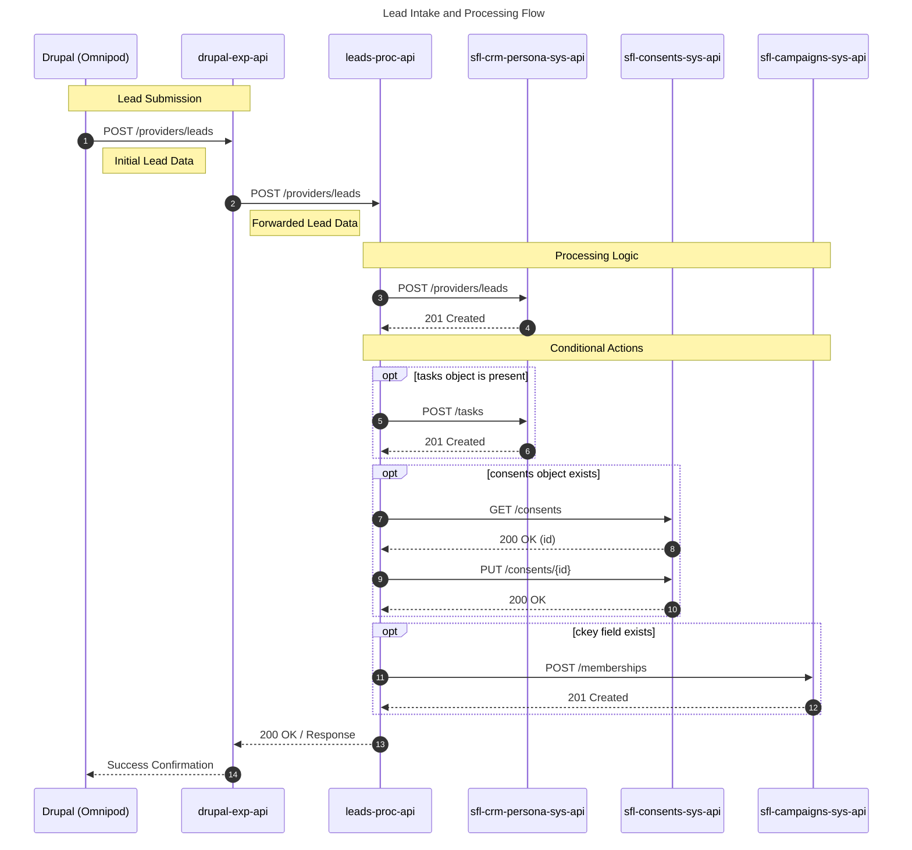
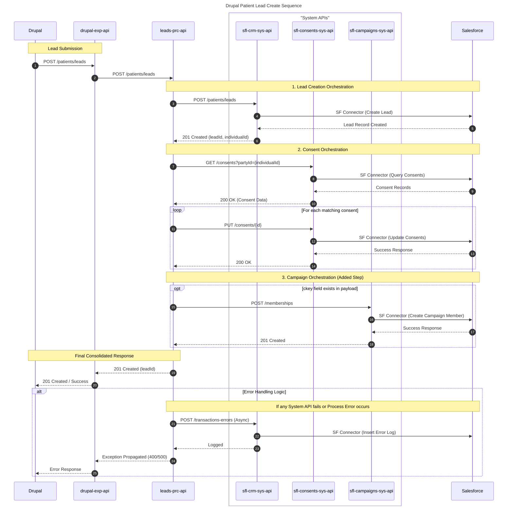

# Design: Insulet Drupal — Drupal to Salesforce Lead Integration
Notebook: Insulet Drupal
Extracted: 2026-05-18

---

## Business Use Case

The primary business use case of this integration is to seamlessly capture, standardize, and process Patient and Healthcare Provider (HCP) leads submitted through various forms on the Omnipod Drupal website. Its core integration purpose is to utilize a secure, API-led connectivity architecture to automate the orchestration of this frontend data directly into the Salesforce CRM system. By decoupling the systems into Experience, Process, and System API layers, the integration dynamically maps lead details, standardizes baseline user consent preferences, and assigns targeted marketing campaign memberships. Ultimately, this synchronized flow conditionally generates follow-up tasks for territory managers and ensures that Insulet's sales and marketing teams have immediate, reliable access to comprehensive lead profiles without requiring manual data entry.

---

## Integration Pattern & Data Flow

### 1. Downstream Systems
The integration connects the Omnipod Drupal frontend to two primary downstream systems:
- **Salesforce CRM:** The core system of record storing Leads, Accounts, Tasks, Campaign Memberships, Consents, and Integration Errors.
- **Okta:** The identity provider used to generate JSON Web Tokens (JWT) to secure the API routing originating from Drupal.

### 2. Data Flows & Orchestration
Data flows synchronously through a three-tiered API-Led Connectivity architecture:
- **Experience to Process:** Drupal submits the raw JSON payload to the Experience API (`drupal-exp-api`). The Experience API intercepts the data, injects mandatory baseline user consents (setting their `source` to "Web"), conditionally injects a follow-up Task if the lead source is "Contact Local TM", and transparently routes the payload to the Process layer.
- **Process to System (Synchronous Lead Creation):** The Process API (`leads-prc-api` or `accounts-proc-api`) acts as the central orchestrator. It first calls the CRM System API to synchronously create or update the Lead/Account in Salesforce and extracts the generated IDs (e.g., `leadId`, `individualId`).
- **Scatter-Gather Parallel Processing:** Using the newly generated IDs, the Process API triggers parallel processing (Scatter-Gather router) across secondary System APIs to generate Tasks, query and update Consents, and assign Campaign Memberships.

### 3. Integration Endpoints

**Experience API (`drupal-exp-api`)**
- `POST /token`: Routes client credentials to Okta to generate a JWT.
- `POST /patients/leads`: Ingests Patient Leads and injects mandatory transactional consents.
- `PUT /patients/leads/{id}`: Passthrough to update a patient lead with HCP affiliations.
- `POST /providers/leads`: Ingests HCP Leads, conditionally injects task objects, and handles campaign assignments.
- `GET /providers/accounts`: Verifies if an HCP account exists via NPI.
- `POST /providers/accounts`: Ingests provider account data.

**Process APIs (`leads-prc-api`, `accounts-proc-api`)**
- `POST /patients/leads`: Orchestrates Patient Lead creation, consents, and campaigns.
- `PUT /patients/leads/{id}`: Queries facility existence via a Choice Router; dynamically routes to either update an existing HCP Lead or create a net-new one before linking it to the patient.
- `POST /providers/leads`: Orchestrates HCP Lead creation, tasks, consents, and campaigns in parallel via Scatter-Gather.
- `PUT /providers/accounts/{id}`: Orchestrates provider account updates, consents, and campaigns.

**System APIs**
- `sfl-crm-persona-sys-api` & `sfl-crm-sys-api`: `POST /patients/leads`, `PUT /patients/leads`, `POST /providers/leads`, `GET /providers/facilities`, `GET /providers/accounts`, `PUT /providers/accounts/{id}`, `POST /transactions-errors`
- `sfl-cases-sys-api`: `POST /tasks`
- `sfl-campaigns-sys-api`: `POST /memberships`
- `sfl-consents-sys-api`: `GET /consents`, `PUT /consents/{id}`
- `okta-identity-sys-api`: `POST /auth/token`

### 4. Field Mappings with Types

#### Patient Lead Creation (`Lead` Object) — via `sfl-crm-sys-api POST /patients/leads`
| API Input | SF Target Field | Mapping Logic |
|---|---|---|
| recordType | RecordTypeId | RecordType Name = Patient (cache lookup) |
| firstName | FirstName | Direct map |
| lastName | LastName | Direct map |
| caregiverFirstname | Caregiver_First_Name__c | Direct map |
| caregiverLastName | Caregiver_Last_Name__c | Direct map |
| email | Email | Direct map |
| typeOfDiabetes | Type_of_Diabetes__c | Direct map |
| preferredLanguage | Preferred_Language__c | Direct map |
| patientDOB | Date_of_Birth__c | Format: YYYY-MM-DD |
| relationshipToPatient | Which_best_describes_you__c | Direct map |
| leadSource | LeadSource | Direct map |
| company | Company | Direct map |
| cKey / cToken | Ctoken__c | Direct map |
| currentTherapy | Current_Therapy__c | Direct map |
| genderIdentity | GenderIdentity | Direct map |
| phone | Phone | Direct map |
| mobilePhone | MobilePhone | Direct map |
| street | Street | Direct map |
| city | City | Direct map |
| state | State | Direct map |
| stateCode | StateCode | Direct map |
| postalCode | PostalCode | Direct map |
| insuranceType | Insurance_Type__c | Direct map |
| insuranceCompany | Insurance_Company_Name__c | Direct map |
| sensorCGM | Sensor_CGM_Continuous_Glucose_Monitor__c | Direct map |
| pifProcess | PIF_Process__c | Direct map |
| callMe | Request_a_Call_Back__c | `if(callMe == "yes") true else if(callMe == "no") false else null` |
| drupalURL | Entire_Drupal_URL__c | Direct map |
| referralOmnipodSource | How_did_you_hear_about_the_Omnipod__c | Direct map |

#### Patient Lead Update — via `sfl-crm-sys-api PUT /patients/leads`
| API Input | SF Target Field | Mapping Logic |
|---|---|---|
| leadId | Id | Prioritized over legacyID |
| legacyID | Legacy_ID__c | Triggers Upsert if only identifier |
| providerAccountId | Related_Provider__c | Direct map |
| practiceAccountId | Practice__c | Direct map |
| facilityId | Provider_Practice_Affiliation__c | Direct map |
| providerLeadId | Provider_Practice_Lead__c | Direct map |

#### HCP Lead Creation (`Lead` Object) — via `sfl-crm-persona-sys-api POST /providers/leads`
| API Input | SF Target Field | Mapping Logic |
|---|---|---|
| recordType | RecordTypeId | RecordType Name = Provider_Practice_Lead (cache) |
| firstName | FirstName | Direct map |
| lastName | LastName | Direct map |
| street | Street | Direct map |
| city | City | Direct map |
| postalCode | PostalCode | Direct map |
| stateCode | StateCode | Direct map |
| email | Email | Direct map |
| hcpType | HCP_Type__c | Direct map |
| degreeDescription | Degree_Description__c | Direct map |
| otherDegreeInfo | Other_DegreeInfo__c | Direct map |
| npi | NPI__c | Direct map |
| licenseNumber | License_Number__c | Direct map |
| phone | Phone | Direct map |
| fax | Fax | Direct map |
| status | Status | Direct map |
| externalSystemId | External_System_ID__c | Direct map |
| leadSource | LeadSource | Direct map |
| patientId | Patient__c | Direct map |
| inquiryDetails | Question_For__c | Direct map |
| drupalURL | Entire_Drupal_URL__c | Direct map |
| statusReason | Status_Reason__c | Direct map |
| practiceName | Practice_Name__c | Direct map |
| facilityId | Provider_Practice_Affiliation__c | Direct map |
| providerAccountId | Related_Provider__c | Direct map |
| practiceAccountId | Practice__c | Direct map |

#### Follow-Up Tasks (`Task` Object) — via `sfl-cases-sys-api POST /tasks`
*Dynamically injected by DataWeave when `leadSource` == "Contact Local TM"*
| API Input | SF Target Field | Mapping Logic |
|---|---|---|
| recordType | RecordTypeId | Lookup via cache ("Sales Activities") |
| subject | Subject | Direct map (hardcoded: "HCP/Physician Outreach Follow-up") |
| phone | Phone | Direct map |
| email | Email | Direct map |
| activityDate | ActivityDate | Dynamic: Now + 1 day |
| status | Status | Hardcoded: "Open" |
| priority | Priority | Hardcoded: "Normal" |
| description | Description | Mapped from inquiry/question |
| relatedPersonId | WhoId | Mapped from generated leadId |
| outreachAttempt | Attempts__c | Hardcoded: "Attempt1" |
| category | Category__c | Hardcoded: "Provider Outreach" |
| subCategory | Sub_Category__c | Hardcoded: "Contact Local TM" |

#### Campaign Memberships (`CampaignMember` Object) — via `sfl-campaigns-sys-api POST /memberships`
| API Input | SF Target Field | Mapping Logic |
|---|---|---|
| campaignKey / campaignName | CampaignId | Lookup via IN clause SOQL on Campaign_Key__c |
| leadId | LeadId | Direct map |
| contactId | ContactId | Direct map |

#### User Consents (Array) — processed via `sfl-consents-sys-api`
| API Input | SF Target | Mapping Logic |
|---|---|---|
| purposeName | purposeName | Baseline: "Marketing Email", "Transactional SMS", "Transactional Email" |
| source | source | Hardcoded: "Web" for all |
| status | status | Passthrough if provided (e.g., "OptIn"); omit otherwise |

#### Global Integration Errors (`Integration_Error__c`) — via `POST /transactions-errors`
| API Input | SF Target Field |
|---|---|
| muleAppName | Mule_App_Name__c |
| correlationId | Correlation_ID__c |
| errorTimestamp | Error_Timestamp__c |
| errorMessage | Error_Message__c |
| payloadData | Payload_Data__c |
| responseData | Response_Data__c |
| errorType | ErrorType__c |
| apiVersion | API_Version__c |
| externalReferenceId | External_Reference_ID__c |
| resolvedFlag | Resolved_Flag__c |
| transactionId | Transaction_Id__c |
| sourceSystem | Source_System__c |
| transactionType | Transaction_Type__c |

---

## Downstream Systems

| System | Role |
|---|---|
| `drupal-exp-api` | Experience API — entry point from Drupal website, enforces security, injects consents & tasks |
| `leads-prc-api` | Process API — orchestrates lead creation, Scatter-Gather for consents/tasks/campaigns |
| `accounts-proc-api` | Process API — orchestrates provider account updates and related consents/campaigns |
| `sfl-crm-persona-sys-api` | System API — creates/updates Patient & HCP leads, tasks, and transaction errors in Salesforce |
| `sfl-crm-sys-api` | System API — CRM data operations for patient leads and provider facilities |
| `sfl-cases-sys-api` | System API — creates Task objects in Salesforce |
| `sfl-consents-sys-api` | System API — GET and PUT consent records in Salesforce |
| `sfl-campaigns-sys-api` | System API — creates Campaign Memberships in Salesforce |
| `okta-identity-sys-api` | System API — generates Okta JWT tokens for authentication |
| Salesforce CRM | System of record for Leads, Accounts, Tasks, Campaigns, Consents, Integration Errors |
| Okta | Identity provider (JWT) |

---

## Business Rules & Validations

### Business Rules

- **Mandatory Consent Injection:** The Experience API must guarantee exactly three transactional consent objects: "Marketing Email", "Transactional SMS", and "Transactional Email" — with `source` hardcoded to "Web" for all.
- **Consent Source & Status Merging:** If Drupal provides a `status` (e.g., "OptIn"), map it exclusively to the matching consent object; otherwise omit `status` entirely.
- **Consent Update Prevention:** If the existing status in Salesforce is already "Opt-in" or "OptIn", skip the update step.
- **Conditional Task Generation:** Inject a `task` object ONLY when `leadSource == "Contact Local TM"`. Hardcoded values: `recordType`: "Sales Activities", `status`: "Open", `priority`: "Normal", `category`: "Provider Outreach", `subCategory`: "Contact Local TM", `activityDate`: Now + 1 day.
- **Conditional Campaign Membership:** When `leadSource != "Contact Local TM"`, omit the task and map `cKey`/`cToken` to `campaignName` for a Campaign Membership.
- **Dynamic HCP Routing (Choice Router):** On `PUT /patients/leads/{id}`, call `GET /providers/facilities`. If 404/empty → create new HCP Lead first; if found → map returned `facilityId`, `providerAccountId`, `practiceAccountId`.
- **Parallel Orchestration (Scatter-Gather):** To meet the 60-second SLA, Tasks, Consent updates, and Campaign Memberships execute in parallel after Lead creation.

### Field Validations

- `firstName` and `lastName` are strictly required strings (HTTP 400 if missing).
- A valid `id` URI parameter is mandatory for all `PUT` operations.
- For `GET /providers/facilities`: `providerNPI` and `postalCode` are mandatory; `city` and `stateCode` are optional.
- For `GET /providers/accounts`: at least one of `npi` or `accountId` must be provided.
- `patientDOB` must be in YYYY-MM-DD format.
- `callMe` (string "yes"/"no") transforms to boolean for `Request_a_Call_Back__c`.
- **Strict Salesforce Picklists:**
  - **LeadSource:** 'Get Started', 'Doctor Discussion Guide', 'Request a Call', 'Empezar', 'Patient Lead', 'Contact Local TM', 'Newsletter Sign-up', 'Retail Referral', 'Phone Intake', etc.
  - **Insurance_Type__c:** 'Commercial', 'Medicare', 'Medicaid', 'Other Government Plan', 'Unknown', 'Cash or No Insurance'
  - **Sensor_CGM_Continuous_Glucose_Monitor__c:** 'Medtronic Guardian', 'Dexcom G6', 'Dexcom G7', 'Freestyle Libre 2', 'Freestyle Libre 2 Plus', 'Freestyle Libre 3', 'Freestyle Libre 3 Plus', 'Other CGM', 'Not Currently Using a Sensor/CGM'
  - **Current_Therapy__c:** 'Insulin Pump', '1-2 Injections per day', '3+ Injections per day', 'Oral Medication', 'Diet & Exercise', 'Other'

---

## Error Handling

- **400 Bad Request:** Missing mandatory fields, missing URI IDs, invalid picklist values, or malformed JSON. Response states the exact missing field.
- **404 Not Found:** DataWeave must explicitly catch empty Salesforce payloads and return 404 rather than a system failure.
- **500 Internal Server Error:** Downstream connectivity, mapping exceptions, or missing RecordTypes. Internal Salesforce stack traces must be scrubbed.
- **Global Transaction Error Logging:** Any failure triggers the Common Error Handler → asynchronous subflow via Notification Connector → `POST /transactions-errors` → logs to `Integration_Error__c` in Salesforce. Fields: `correlationId`, stringified `payloadData`, `errorMessage`, `errorType`.
- **No Dead Letter Queue (DLQ):** No DLQ is used. Drupal retries on failure; Salesforce deduplication handles duplicate leads.
- **Datadog Logging:** All applications use `log4j2` Datadog appender for centralized log shipping (service name, environment metadata).

---

## Briefing Document

### 1. Key Architectural Decisions

- **API-Led Connectivity Architecture:** Three-tier decoupling: Experience API (`drupal-exp-api`) applies frontend business rules; Process APIs (`leads-prc-api`, `accounts-proc-api`) manage orchestration; System APIs handle direct Salesforce manipulation.
- **Synchronous Processing with Scatter-Gather Routing:** Core Lead creation is synchronous (returns `leadId` to Drupal immediately). Subsequent Tasks, Consents, and Campaigns run in parallel via Scatter-Gather to meet the 60-second SLA.
- **Automated Security & Authentication Policies:** Client ID Enforcement on `/token` only; JWT Validation on all other endpoints using regex `(?!/token$).*$`.
- **Dynamic Upsert & Identifier Resolution:** `PUT` payloads with both `leadId` and `legacyID` prioritize `leadId`. If only `legacyID` present, Salesforce Connector performs Upsert against `Legacy_ID__c`.
- **Dynamic RecordType Caching:** SOQL query on startup `SELECT Id, Name, DeveloperName, SObjectType FROM RecordType WHERE IsActive = true AND SobjectType IN ('Account', 'Lead', 'Task')`. Cached in Object Store with 30-day TTL.

### 2. Open Questions & Resolved Clarifications

- **Partial Orchestration Failures & DLQ:** No DLQ. Drupal retries; SF deduplication prevents duplicate leads. (Resolved)
- **Task Insertion Permissions:** Error `entity type cannot be inserted: Task CANNOT_INSERT_UPDATE_ACTIVATE_ENTITY` — permission issue tracked under NGOMCT-3481.
- **Missing Salesforce Fields:** `Question_For__c` missing from Lead object — raised under NGASIM-3921.
- **Authentication Setup:** Open questions about Drupal's Okta registration (Client ID/Secret) and `serverId` for JWKS URL per environment.
- **Data Formatting Assumptions:** Phone number format — no MuleSoft transformations needed; Drupal ensures correct format. (Resolved)

### 3. Risks

- **Strict Picklist Validation Failures:** If Drupal doesn't match exact Salesforce API Names → HTTP 400 rejection.
- **Data Deduplication Overwrites:** Retry mechanism relies entirely on SF deduplication; risk of duplicate tasks or data overwrites.
- **Synchronous Timeout Limitations:** Running up to four downstream System APIs synchronously risks exceeding 60-second SLA if Salesforce experiences latency.

### 4. Recommended Implementation Approach

- **Phase 1:** Parent-POM & Global Standardization — update to `mule-common-pom` v1.0.9 (Root BU), remove `na-` prefix.
- **Phase 2:** System APIs & Foundational Caching — implement System layer, set up Object Store caching (30-day TTL) via startup SOQL.
- **Phase 3:** Global Error Handling & Datadog — integrate Common Error Handler, Notification Connector, `log4j2.xml` Datadog appender.
- **Phase 4:** Process API Orchestration — build `leads-prc-api` and `accounts-proc-api` with Choice Routers and Scatter-Gather.
- **Phase 5:** Experience API & Security Enforcement — configure API Manager policies, build DataWeave consent/task injection logic.

---

## Study Guide

### Acronyms
- **HCP**: Healthcare Provider
- **HCPF**: Healthcare Practitioner Facility
- **NPI**: National Provider Identifier
- **CGM**: Continuous Glucose Monitor
- **PIF**: Patient Information Form
- **JWT**: JSON Web Token
- **SOQL**: Salesforce Object Query Language
- **TTL**: Time To Live (Object Store caching)
- **NFR**: Non-Functional Requirement (95% of requests within 60 seconds)
- **DLQ**: Dead Letter Queue (intentionally NOT used)
- **RAML**: RESTful API Modeling Language
- **POM / BOM**: Project Object Model / Bill of Materials

### Key Concepts

**1. API-Led Connectivity Architecture**
Three-tier MuleSoft architecture: Experience API → Process APIs → System APIs.

**2. Synchronous Orchestration and Scatter-Gather Processing**
Core lead creation is synchronous; secondary Tasks/Consents/Campaigns run in parallel via Scatter-Gather to meet 60-second NFR.

**3. Dynamic Task Injection**
When `leadSource == "Contact Local TM"`: inject task with hardcoded values. All other sources: omit task, add campaign membership instead.

**4. Baseline Consent Injection & Management**
Three mandatory consents injected: "Marketing Email", "Transactional SMS", "Transactional Email". Source hardcoded to "Web". Skip update if SF already has "Opt-in".

**5. Verification & Lead Resolution (Upsert Logic)**
- Facility lookup via Choice Router before updating Patient Lead with HCP affiliation.
- `leadId` takes priority over `legacyID`; latter triggers Upsert against `Legacy_ID__c`.

**6. Global Asynchronous Error Handling**
Common Error Handler → async subflow via Notification Connector → `POST /transactions-errors` → logs to `Integration_Error__c`. No DLQ.

**7. Object Store Caching**
SOQL query on startup for RecordTypes. Object Store cache with 30-day TTL maps string names to Salesforce IDs.

**8. Security & Authentication Policies**
Client ID Enforcement on `/token`. JWT Validation (regex `(?!/token$).*$`) on all business endpoints.

**9. Strict Picklist Enforcement**
Salesforce rejects HTTP 400 for any picklist value not matching exact API names.

### Definitions
- **`drupal-exp-api`**: Experience API — entry point from Drupal, applies business rules (task/consent injection), enforces security.
- **`leads-prc-api`**: Process API — orchestrates Lead creation, Scatter-Gather Consent updates, Campaign matching.
- **Salesforce Composite Request**: Multiple CRUD operations in one call with `allOrNone: true` for transactional integrity.
- **`cKey` / `cToken`**: Field from Drupal mapped to `campaignName`; Campaigns API translates to Salesforce `CampaignId` via `Campaign_Key__c`.
- **`okta-identity-sys-api`**: System API for Okta authentication and JWT generation.

### Open Questions / Knowledge Checks
1. How does `drupal-exp-api` use DataWeave to conditionally inject a Task object, and what `leadSource` triggers it?
2. Explain the regex `(?!/token$).*$` in the context of the JWT Validation Policy.
3. Why is Scatter-Gather essential for meeting NFRs in the Process API layer?
4. Describe the error handling sequence if a downstream SF API times out — how does the error reach `Integration_Error__c`?
5. What three consent objects are automatically injected by the Experience API, and what is their default `source`?
6. How does the Process API use a Choice Router to prevent duplicate HCPF creation on `PUT /patients/leads/{id}`?
7. If both `leadId` and `legacyID` are present, which does DataWeave prioritize, and what connector operation does the fallback trigger?

---

## FAQ

**Q: How do I authenticate and secure the Experience API endpoints?**
A: Two automated API Manager policies: Client ID Enforcement on `/token` only; JWT Validation (regex `(?!/token$).*$`) on all business endpoints.

**Q: What is the orchestration pattern, and how do I meet the 60-second SLA?**
A: API-Led Connectivity (Experience → Process → System). Initial Lead creation is synchronous. Scatter-Gather router runs Tasks, Consents, and Campaigns in parallel after Lead creation.

**Q: How does DataWeave handle mandatory baseline user consents?**
A: Inject exactly three objects: "Marketing Email", "Transactional SMS", "Transactional Email". Hardcode `source` to "Web". Passthrough `status` if provided; omit if not. Skip SF update if status is already "Opt-in"/"OptIn".

**Q: Under what conditions should I dynamically inject a Task object?**
A: Only when `leadSource == "Contact Local TM"`. Hardcode: `recordType`: "Sales Activities", `status`: "Open", `priority`: "Normal", `category`: "Provider Outreach", `subCategory`: "Contact Local TM", `activityDate`: Now + 1 day. Omit entirely for other lead sources.

**Q: How do we determine whether to perform an Update or Upsert when modifying a Lead?**
A: DataWeave evaluates `leadId` > `legacyID` priority. If only `legacyID` present, configure Salesforce Connector for Upsert against `Legacy_ID__c`.

**Q: How should the System APIs handle Salesforce RecordTypeIds to avoid hardcoding?**
A: Execute startup SOQL: `SELECT Id, Name, DeveloperName, SObjectType FROM RecordType WHERE IsActive = true AND SobjectType IN ('Account', 'Lead', 'Task')`. Cache in Object Store with 30-day TTL.

**Q: What is the error handling strategy if partial failures occur, and is a DLQ used?**
A: No DLQ. Global Common Error Handler catches failures → async subflow → `POST /transactions-errors` → `Integration_Error__c`. Drupal retries; SF deduplication prevents duplicates. Stack traces must not be exposed.

**Q: What Maven and logging configurations are required for deployment?**
A: Update `pom.xml` to `mule-common-pom` v1.0.9 (Root BU Group ID: `260ebaee-d8f1-4739-bb12-b8db2f1568ca`). Remove `na-` prefix from all API names. Route all internal calls via Insulet Vanity URL. Update `log4j2.xml` with Datadog appender.

---

## Diagram Sources

### Diagram: HCP Lead Sequence Diagram Script

---

### Diagram: Patient Lead Sequence Diagram Post /patients/leads

---

## Jira / Confluence References

### Jira Story IDs

**NGCRMI Series:** NGCRMI-1852, NGCRMI-1872, NGCRMI-1873, NGCRMI-1875, NGCRMI-1876, NGCRMI-1877, NGCRMI-1878, NGCRMI-1879, NGCRMI-1880, NGCRMI-1881, NGCRMI-1882, NGCRMI-1883, NGCRMI-1884, NGCRMI-1885, NGCRMI-1887, NGCRMI-1888, NGCRMI-1906, NGCRMI-1907, NGCRMI-1908, NGCRMI-1909, NGCRMI-3215, NGCRMI-3241, NGCRMI-3242, NGCRMI-3247, NGCRMI-3351, NGCRMI-3514, NGCRMI-3515, NGCRMI-3516, NGCRMI-3517, NGCRMI-3520, NGCRMI-3521, NGCRMI-3625, NGCRMI-3804, NGCRMI-3806, NGCRMI-3807, NGCRMI-3808, NGCRMI-3843, NGCRMI-3844, NGCRMI-4050, NGCRMI-4051, NGCRMI-4052, NGCRMI-4053, NGCRMI-4104, NGCRMI-4111, NGCRMI-4116, NGCRMI-4117, NGCRMI-4118, NGCRMI-4140, NGCRMI-4141, NGCRMI-4142, NGCRMI-4282, NGCRMI-4283, NGCRMI-4284, NGCRMI-4349, NGCRMI-4350, NGCRMI-4351, NGCRMI-4352, NGCRMI-4353, NGCRMI-4479

**NGASIM Series:** NGASIM-1717, NGASIM-2422, NGASIM-2463, NGASIM-2813, NGASIM-2979, NGASIM-2980, NGASIM-2981, NGASIM-3032, NGASIM-3035, NGASIM-3206, NGASIM-3921

**NGOMCT Series:** NGOMCT-3481

**NGONDL Series:** NGONDL-187, NGONDL-475, NGONDL-556, NGONDL-572, NGONDL-583, NGONDL-584, NGONDL-585, NGONDL-586, NGONDL-587, NGONDL-588, NGONDL-589

### Confluence Page URLs

- https://confluence.prod.insulet.com/wiki/spaces/Mule/pages/139432531/API+Access+Token+Service
- https://confluence.prod.insulet.com/wiki/spaces/Mule/pages/139432793/DataDog+-+Observability
- https://confluence.prod.insulet.com/wiki/spaces/Mule/pages/246775933/sfl-consents-sys-api
- https://confluence.prod.insulet.com/wiki/spaces/Mule/pages/264470788/sfl-crm-persona-sys-api#POST-%2Ftasks
- https://confluence.prod.insulet.com/wiki/spaces/Mule/pages/264470788/sfl-crm-sys-api#POST-%2Fpatient%2Fleads
- https://confluence.prod.insulet.com/wiki/spaces/Mule/pages/270401539/leads-proc-api#POST-%2Fproviders%2Fleads
- https://confluence.prod.insulet.com/wiki/spaces/Mule/pages/306708481/drupal-exp-api
- https://confluence.prod.insulet.com/wiki/spaces/Mule/pages/306708481/drupal-exp-api#Backend-Mapping-and-Logic
- https://confluence.prod.insulet.com/wiki/spaces/Mule/pages/306708481/drupal-exp-api#POST-%2Fpatients%2Fleads
- https://confluence.prod.insulet.com/wiki/spaces/Mule/pages/456065044/sfl-cases-sys-api#POST-%2Ftasks

---

## Source Summaries

### Source: Contact Your Local Omnipod® Representative | Omnipod
**Keywords:** Omnipod representative contact, Healthcare provider resources, Medical device correction, Insulin delivery systems, Prescribing process information

This digital resource serves as a professional gateway for healthcare providers to connect with Insulet Corporation regarding the Omnipod insulin management systems. The page functions primarily as an interactive portal where clinicians can request detailed information on prescribing procedures, insurance coverage, and the various technical specifications of the Omnipod 5 and DASH products. Beyond the central contact inquiry form, the site hosts a comprehensive navigation menu that directs medical professionals toward clinical research, patient education materials, and global regional settings. The text also includes an urgent medical correction notice and extensive disclosures concerning data privacy and cookie management.

---

### Source: GS CB 1A | Omnipod
**Keywords:** Omnipod 5 Pod, Diabetes Management Products, Medical Device Correction, Insurance Cost Coverage, Cookie Privacy Policy

This source provides a comprehensive overview of the digital ecosystem for Omnipod, a medical technology platform dedicated to automated insulin delivery for individuals living with diabetes. Central to the document is a high-priority medical device correction notice, which alerts users to verify the safety status of specific equipment batches. The source details extensive data privacy protocols and cookie management settings.

---

### Source: HCP Lead Sequence Diagram Script
**Keywords:** Lead intake flow, Sequence diagram script, Data processing logic, API integration, HCP lead submission

This technical diagram illustrates the automated workflow for capturing and managing professional healthcare leads through a series of interconnected digital systems. The process begins when a web platform submits data to specialized experience and processing layers, which act as the brain of the operation to ensure information is routed correctly. Depending on the specific details provided, the system dynamically updates individual profiles, legal consent records, and marketing campaign memberships across various databases.

---

### Source: HCP Newsletter Sign-up | Omnipod
**Keywords:** Healthcare Professional Newsletter, Omnipod Insulin Products, Medical Device Correction, Prescriber Clinical Resources, Website Cookie Policy

This digital portal facilitates a newsletter registration for healthcare professionals requiring verification of clinical credentials. The site features a prominent medical device correction notice and a detailed navigation structure covering product specifications, prescribing guidelines, and clinical research.

---

### Source: HCP drupal-exp-api POST /provider/lead json example
**Keywords:** API JSON example, Healthcare provider data, Lead generation, Contact information, Consent management

A technical template serving as a blueprint for transmitting detailed healthcare provider information to a centralized database via an electronic interface. Captures professional identity, medical credentials, and specific clinical interests with communication consent documented alongside contact preferences.

---

### Source: HCP leads-proc-api POST /provider/leads Json Example
**Keywords:** API JSON Example, Provider Lead Data, HCP Professional Information, Task Management Details, Marketing Consent Status

This data structure represents a digital handshake between a healthcare professional and a medical organization. The inclusion of an automated task object ensures follow-up activities are scheduled and tracked, bridging the gap between an initial inquiry and an active professional relationship.

---

### Source: HCP sfl-crm-persona-sys-api POST /provider/leads
**Keywords:** API documentation, Provider lead data, HCP profile information, CRM system integration, Medical professional details

This technical snippet illustrates a structured data exchange designed to capture and transmit professional information regarding a specific healthcare provider, linking clinical practitioners to their respective medical facilities and tracking the status of their professional requests.

---

### Source: Healthcare provider | Account Contact | Omnipod
**Keywords:** Healthcare provider resources, Omnipod insulin systems, Medical device corrections, Prescribing and coverage, Cookie privacy policies

This digital portal serves as a comprehensive resource hub for healthcare professionals managing patients using the Omnipod insulin delivery system, providing streamlined access to prescribing information, clinical research, and pharmacy support.

---

### Source: Mule-accounts-proc-api.pdf
**Keywords:** accounts Process API, API Orchestration Logic, Backend Data Mapping, Failure Handling Procedures, Non-Functional Requirements

The `accounts-proc-api` is a MuleSoft process API designed to manage the lifecycle of patient and provider accounts by coordinating multiple backend systems. It orchestrates account creation/updating, manages legal consent records, and assigns campaign memberships through parallel and asynchronous workflows using Scatter-Gather.

---

### Source: Mule-drupal-exp-api-v2.pdf
**Keywords:** Drupal Experience API, Patient Lead Orchestration, Provider Account Management, API Security Policies, Backend System Mapping

The `drupal-exp-api` technical blueprint details the middle-layer designed to orchestrate data flows between the web interface and Salesforce. Covers endpoints for token generation, patient lead creation/update, provider account verification, data mapping logic, and non-functional requirements.

---

### Source: Mule-drupal-exp-api.pdf
**Keywords:** Drupal Experience API, Patient Lead Orchestration, API Endpoint Specification, Data Mapping Logic, Authentication and Security

The Drupal Experience API orchestrates the lifecycle of leads by connecting web-based inputs with backend Salesforce systems. It manages consent lifecycle, uses standardized mapping logic, and transforms raw Drupal data into actionable records.

---

### Source: Mule-leads-prc-api.pdf
**Keywords:** Patient lead orchestration, Lead Process API, Salesforce backend mapping, Consent management, Healthcare provider integration

The Lead Process API automates the creation of leads, manages legal consent records, and assigns individuals to specific marketing campaigns. It details three primary operations: generating new patient profiles, updating existing records with practitioner data, and handling complex provider outreach tasks.

---

### Source: Mule-sfl-campaigns-sys-api-v2.pdf
**Keywords:** SF Campaigns API, Backend Mapping Logic, Salesforce Connector Integration, API Security Policies, MUnit Test Coverage

The `sfl-campaigns-sys-api` is a MuleSoft system API that uses `POST /memberships` to transform lead/contact data into standardized Salesforce campaign member objects via DataWeave and bulkified SOQL queries. 100% MUnit test coverage reported.

---

### Source: Mule-sfl-campaigns-sys-api.pdf
**Keywords:** SF Campaigns API, Mule Application Technicals, Salesforce Connector Integration, API Resource Endpoints, MUnit Coverage Report

The `sfl-campaigns-sys-api` bridges external entities and Salesforce campaign data. Its `POST /memberships` endpoint creates new campaign member associations. Includes DataWeave logic and SOQL queries with robust non-functional requirements (Client ID Enforcement, high MUnit coverage).

---

### Source: Mule-sfl-crm-persona-sys-api-new.pdf
**Keywords:** Salesforce Lead Integration, API Technical Documentation, Backend Field Mapping, DataWeave Transformation Logic, System Error Handling

The `sfl-crm-persona-sys-api` facilitates data exchange between external platforms and Salesforce, supporting Patient and HCP lead management, integration error logging, and task scheduling. Uses DataWeave for payload transformation, SOQL for record caching, and Client ID Enforcement for security.

---

### Source: Mule-sfl-crm-persona-sys-api-v2.pdf
**Keywords:** SF Leads API, Salesforce Integration Mapping, Patient Lead Management, Provider Facility Queries, Transaction Error Logging

The `sfl-crm-persona-sys-api-v2` manages lead and account data for patients and healthcare providers, facilitating creation, updates, and facility affiliation queries. Defines DataWeave mapping logic, security protocols, and SOQL queries.

---

### Source: Mulesoft Drupal Patient HCP Lead.pdf
**Keywords:** MuleSoft API Integration, Drupal Patient Forms, Salesforce CRM Leads, OKTA Authentication Security, Healthcare Provider Data

Technical workflow connecting Drupal web forms to Salesforce CRM via MuleSoft APIs. Covers Okta authentication, data validation, error handling protocols, and lead management for medical professional and patient data.

---

### Source: Patient Lead Sequence Diagram Post /patients/leads
**Keywords:** Patient Lead Sequence, Salesforce Integration, API Orchestration, Consent Management, Error Handling Logic

Technical diagram outlining the orchestration of patient lead data from Drupal through a series of specialized APIs into Salesforce. Includes lead creation, consent synchronization, optional campaign membership, and asynchronous error logging.

---

### Source: Salesforce Composite Task API Payload
**Keywords:** Salesforce API, Composite Request, Task Management, Payload Structure, Data Integration

Blueprint for a batch processing instruction using composite request structure to create a Task object in Salesforce. Uses "all or none" transactional integrity with metadata for medical outreach tracking.

---

### Source: Salesforce HCP Lead Composite request
**Keywords:** Salesforce API, Composite Request, HCP Lead Data, SObject Lead, JSON Data Structure

Structured data request to create a new HCP Lead record in Salesforce using composite format. Captures professional credentials including NPI, medical degrees, and practice affiliations. Uses `allOrNone: true`.

---

### Source: Task sfl-crm-persona-sys-api POST /task Json Example
**Keywords:** API JSON Example, Sales Activities, Provider Outreach, Task Management, Healthcare Communication

Technical snippet illustrating structured data format for automating Sales Activity task creation in Salesforce CRM, linking clinical inquiries to a unique person identifier.

---

### Source: [#NGCRMI-1876] drupal-exp-api — HCP Lead Creation
**Keywords:** HCP Lead Creation, Mule Inbound Integration, DataWeave Transformation, API Specification RAML, Consent Mapping Logic

High-priority technical specification for a MuleSoft Experience API to bridge Drupal and Salesforce CRM. Primary goal: standardize HCP lead data, automate consent management, and conditionally create follow-up tasks for territory managers.

---

### Source: [#NGCRMI-1878] okta-identity-sys-api — drupal-exp-api
**Keywords:** Okta JWT Authentication, MuleSoft API Integration, Client ID Enforcement, JWT Validation Policy, Token Generation Flow

Implementation of secure authentication and authorization framework: Client ID Enforcement for `/token` endpoint; JWT Validation (regex `(?!/token$).*$`) for all business endpoints.

---

### Source: [#NGCRMI-1881] leads-proc-api — HCP Lead Creation
**Keywords:** HCP Lead Creation, Mule Inbound Integration, API Orchestration, RAML Specification, Global Error Handling

Development story for `leads-proc-api` to orchestrate HCP leads in Salesforce. Uses parallel Scatter-Gather processing for Tasks, Consents, and Campaigns. Strict acceptance criteria and error-handling protocols.

---

### Source: [#NGCRMI-1883] Patient Lead Create — SF sys-api
**Keywords:** Mule Inbound Integration, Salesforce Lead Creation, API Specification RAML, Data Mapping Transformation, Datadog Log Integration

Development story for a MuleSoft System API implementing `POST /patients/leads` with RAML refactoring, data mapping, error handling standards, and Datadog integration.

---

### Source: [#NGCRMI-1885] Salesforce Drupal User connection validation
**Keywords:** MuleSoft Salesforce Connector, Connection Validation, Drupal User Integration, Permission Verification, System API Configuration

Technical task focused on validating the connection between Drupal and Salesforce via MuleSoft, verifying the new service account's authentication and authorization settings.

---

### Source: [#NGCRMI-1887] sfl-cases-sys-api — Create Task
**Keywords:** Mule Inbound Integration, Task Creation API, Salesforce Connector, RAML Design Specification, API Error Handling

Development story for `sfl-cases-sys-api POST /tasks` endpoint to automate Task creation in Salesforce. Uses RecordType caching (30-day TTL) and robust error-handling framework.

---

### Source: [#NGCRMI-1888] sfl-crm-persona-sys-api — HCP Lead
**Keywords:** HCP Lead Creation, MuleSoft API Integration, Salesforce Data Mapping, RAML Specification Updates, Dynamic SOQL Generation

Enhancement of `sfl-crm-persona-sys-api` with new HCP lead fields (license numbers, inquiry details) and refactored facility lookup logic with dynamic SOQL generation.

---

### Source: [#NGCRMI-3215] QA Patient Lead Create — sfl-crm-sys-api
**Keywords:** Mule Inbound Integration, Patient Lead Creation, API Specification Development, Salesforce Data Mapping, Quality Assurance Testing

Development and successful testing of MuleSoft System API for patient lead data from Drupal to Salesforce. Full QA validation completed.

---

### Source: [#NGCRMI-3521] Patient Update Lead HCP — drupal-exp-api
**Keywords:** Drupal Mule Integration, Patient Lead Update, API Technical Implementation, Acceptance Criteria Validation, Error Handling Integration

High-priority story implementing `drupal-exp-api` as a transparent passthrough layer to `leads-prc-api` for updating Patient Lead HCP affiliations.

---

### Source: [#NGCRMI-3843] QA Only — Patient Lead Implementation — drupal-exp-api
**Keywords:** Patient Lead Implementation, RAML Specification Update, Mule Inbound Integration, Experience API Testing, Error Handling Logic

Completed software task enabling automated creation of patient leads from Drupal via `drupal-exp-api`. Passed all QA testing phases.

---

### Source: [#NGCRMI-3844] QA Only — Patient Lead Orchestration — leads-prc-api
**Keywords:** Patient Lead Orchestration, Mule Inbound Integration, API Quality Assurance, Consent Management Logic, Campaign Membership Registration

`leads-prc-api` process-level integration story for synchronous lead creation, patient privacy consent management, and campaign registration. Integration infrastructure confirmed functional.

---

### Source: [#NGONDL-556] Retrofit — Update parent POM and BOM to use Root org
**Keywords:** Parent POM Updates, Root Org Transition, Global Naming Standards, Datadog Integration, Maven Build Configuration

MuleSoft modernization project: update APIs to Root BU parent POM (`mule-common-pom` v1.0.9), remove `na-` prefix, implement Datadog logging integration, and route internal calls via Insulet Vanity URL.

---

### Source: information Extra
**Keywords:** Salesforce Picklist Values, Lead Source Categories, Insurance Type Options, Sensor CGM Products, Current Therapy Methods

Backend configuration of Salesforce picklist fields: LeadSource, Insurance_Type__c, Sensor_CGM_Continuous_Glucose_Monitor__c, and Current_Therapy__c. Defines all approved dropdown values for data consistency and reporting.
