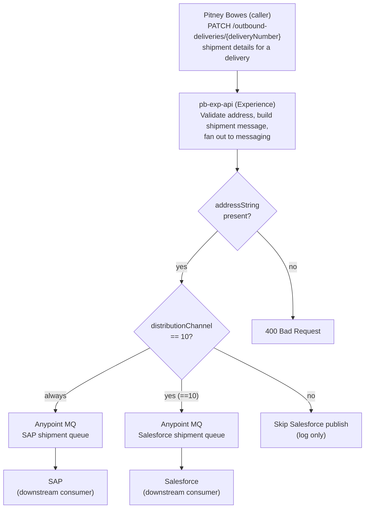

# pb-exp-api — Migration Solution Design

> Baselined on the legacy `pb-exp-api` project + notes. Migration Status in §6 is assessed
> against the already-migrated build provided in `input/migrated-api/pb-exp-api/`.
> Companion Gap Analysis: `Ref: GAP-pb-exp-api` (`pb-exp-api-gap-analysis.md`).
>
> **In-scope endpoint (Infinity scope):** `PATCH /outbound-deliveries/{deliveryNumber}`.
> All other business endpoints are listed as `Out of scope for Infinity scope`.

---

## 1. Application Overview

| Title | Description |
|---|---|
| Application Technical Name | `pb-exp-api` |
| Application Business Name | Pitney Bowes Experience API |
| Business Domain | Delivery & Shipment (Supply Chain / Logistics) — Pitney Bowes ⇄ SAP / Salesforce |
| Available Versions | v1 (`1.0.0`) — API spec `pb-exp-api-spec:1.0.0` |
| Purpose of API | Experience-layer API that receives Pitney Bowes delivery/shipment events and distributes them to SAP and Salesforce over Anypoint MQ, and retrieves outbound-delivery details from the SAP system layer. In-scope for this design: accept a shipment-details update for a delivery and fan it out to the SAP shipment queue and (conditionally) the Salesforce shipment queue. |
| Mule Application Type | Mule 4 application (`mule-application`), CloudHub-deployed. `minMuleVersion` 4.9.0, Java 17. |
| API Type | RESTful Experience API (JSON over HTTPS) |
| GitHub Repo URL | `https://github.com/CFSW-E2E-Mulesoft/pb-exp-api.git` |
| Healthcheck Endpoints | `GET /api/ping` (implemented). `GET /api/health-check` — TBC (not implemented; required by standard). |
| Exchange Specification URL | Anypoint Exchange asset `pb-exp-api-spec` (org `e0bc8c96-9dbd-48bc-915e-3e29577af6b3`), version `1.0.0` — full URL TBC |
| Monitoring Dashboard URL | Datadog (service `pb-exp-api`, apiLayer `exp`) via Datadog log4j appender — exact dashboard URL TBC |
| API Manager URL | TBC — API instance id `19124349` (prod) / `18725433` (dev) |
| Runtime URLs | CloudHub (region `na`) — per-environment hostnames TBC |
| Postman Collection File | TBC |
| Properties Configured | `properties/config.yaml` (base) + `properties/config-{env}-{region}.yaml`. Keys include HTTP port/timeout, retry attempts/interval, logger category/keys, AMQ url/queues (`amq.pb.sap.shipment.queue`, `amq.pb.sf.shipment.queue`, `amq.pod.queue`), `shipment.source`/`shipment.target`, SAP host/path/timeout, region. |
| Azure Vault Keys and Credentials Details | Azure Key Vault properties provider. Keys observed: `global-logger-encryption-key`, `na-integrations-na-common-mule-mq-client-id`, `na-integrations-na-common-mule-mq-client-secret`, (commented) `na-integrationsna-common-mule-internal-client-id` / `-client-secret`. See §6 — cleartext secrets still present in base config. |
| Depends on Mule Apps/APIs | SAP system API (`sap-shipment-sys-api` / `sap-account-order-sys-api` — used by the out-of-scope GET); Anypoint MQ (SAP + Salesforce shipment queues, POD queue); Salesforce & SAP as downstream queue consumers. |
| Insulet Connectors/Libraries Used | Legacy: `common-logging-error-handling-module`. Migrated target: Custom Logger connector (`module-logger`) + `log4j-datadog-appender`, parent `mule-common-pom`. |
| Other Libraries and Connectors Used | HTTP Connector, Anypoint MQ Connector, APIKit, Validation Module, Sockets. Legacy also: Secure Configuration Properties, Scripting, CloudHub Connector. |
| API Manager Policies Applied | Client ID Enforcement (via API Autodiscovery) — present in legacy; **not wired in migrated build** (see §6). Additional policies TBC. |
| Parent-POM | Legacy: `com.mycompany:my-app:1` (placeholder — non-standard). Migrated target: `260ebaee-d8f1-4739-bb12-b8db2f1568ca:mule-common-pom:1.0.9`. |

---

## 2. Non-Functional Requirements

| Type | Description |
|---|---|
| Authentication | Client ID Enforcement via API Manager automated policy (client_id / client_secret per calling app). TLS in transit. Exact scheme TBC. |
| Response Time | TBC |
| Number of transactions to be processed | TBC |
| Spike Control | TBC |
| Rate-Limiting SLA | TBC |

---

## 3. High-Level Architecture



The API validates the inbound shipment payload, then performs a parallel fan-out: it always
publishes a normalized shipment message to the SAP shipment queue, and — only when the delivery's
`distributionChannel` is `10` — also publishes to the Salesforce shipment queue. SAP and Salesforce
consume from their queues asynchronously. A synchronous acknowledgement is returned to the caller.

---

## 4. Interface Specification

### Resources

| Resource Name | Supported Methods | Description |
|---|---|---|
| `/api/ping` | GET | Liveliness health check (implemented). |
| `/api/health-check` | GET | Readiness health check — TBC (not yet implemented; required by standard). |
| `/outbound-deliveries/{deliveryNumber}` | PATCH | **In scope.** Accept a shipment-details update for a delivery and fan it out to the SAP and (conditionally) Salesforce shipment queues. |
| `/outbound-deliveries` | GET | Out of scope for Infinity scope |
| `/pods` | POST | Out of scope for Infinity scope |

---

### 4.1 PATCH `/outbound-deliveries/{deliveryNumber}`

> **Cross-cutting (applies to this endpoint):** a request context is captured on entry
> (correlationId, business entity identifiers) and emitted through the Insulet Custom Logger at
> received / success / error checkpoints; correlation-id is propagated to downstream messages as MQ
> user properties. These concerns are intentionally omitted from the diagram and mapping steps.

#### 4.1.1 Input

Path parameter: `deliveryNumber` (string, required) — the SAP delivery document number.

| Field | Type | Required? | Description |
|---|---|---|---|
| `salesOrderNumber` | String | Yes | Sales order the shipment belongs to (used as the business entity id for logging/tracing). |
| `distributionChannel` | String | Yes | SAP distribution channel; value `10` additionally routes the message to Salesforce. |
| `packingSlipId` | String | Yes | Packing slip / delivery document identifier. |
| `addressString` | String | Yes | Ship-to address as a single string. Must be non-blank (validated). |
| `package` | Array&lt;Object&gt; | Yes | One or more shipped packages. |
| `package[].trackingNumber` | String | Yes | Carrier tracking number. |
| `package[].carrierUsed` | String | Yes | Carrier name (e.g., FedEx, USPS). |
| `package[].serviceUsed` | String | Yes | Shipping service (e.g., Ground, Air). |
| `package[].shippingCost` | Number | No | Shipping cost for the package. |

**Example request**

```json
{
  "salesOrderNumber": "110002222",
  "distributionChannel": "10",
  "packingSlipId": "0080001254",
  "addressString": "21106 Park Brook Dr, Katy, TX, 77450, US",
  "package": [
    { "trackingNumber": "TrackingNumber1", "carrierUsed": "FedEx", "serviceUsed": "Ground", "shippingCost": 13 },
    { "trackingNumber": "TrackingNumber2", "carrierUsed": "USPS", "serviceUsed": "Air", "shippingCost": 14 }
  ]
}
```

#### 4.1.2 Mapping (Source → Target → Transformation)

**Step 0 — Receive & set context.** Capture `correlationId` (from inbound header, defaulted when
absent), set the business entity id from `salesOrderNumber`, capture `deliveryNumber` from the URI,
and resolve `source`/`target` context values from configuration. Log "event received".

**Step 1 — Validate.** Assert `addressString` is a non-blank string; a blank value is mapped to a
client bad-request error (see 4.1.3).

**Step 2 — Fan-out (parallel).** Two routes execute in parallel:

- **Route A — SAP shipment queue (always).**
- **Route B — Salesforce shipment queue (only when `distributionChannel == 10`).** Otherwise the
  Salesforce publish is skipped and an informational log is written.

For each route, the target is an Anypoint MQ message. The normalized message body is built from the
request as follows (identical shape for both queues):

| Source Field/Object | Target Field/Object | Transformation Logic | Notes |
|---|---|---|---|
| `salesOrderNumber` | `salesOrderNumber` | Pass-through | Also carried as MQ user property `entityId`. |
| `distributionChannel` | `distributionChannel` | Pass-through | Drives Route B routing decision. |
| `packingSlipId` | `packingSlipId` | Pass-through | |
| `addressString` | `addressString` | Pass-through | Ship-to address (PII — must be masked in logs, see §6). |
| `package[]` | `package[]` | Re-projected per element to `{ trackingNumber, carrierUsed, serviceUsed, shippingCost }` | Array preserved 1:1. |
| — (constant) | `deliveryDate` | Set to empty string placeholder | Reserved for a common queue-message schema shared with POD flow. |
| `deliveryNumber` (URI) | `deliveryNumber` | Set to empty string placeholder in body | The delivery number is carried as an MQ user property, not in the body. |
| — (constant) | `trackingNumber` | Set to empty string placeholder | Package-level tracking numbers live under `package[]`. |
| config `shipment.source` | envelope `source` | From configuration | Prepended to the message envelope. |
| config `shipment.target` | envelope `target` | From configuration | Prepended to the message envelope. |
| config `region` | envelope `region` | From configuration | Prepended to the message envelope. |
| `correlationId` | MQ user property `correlationId` | Pass-through | For end-to-end tracing. |
| `salesOrderNumber` | MQ user property `entityId` | Pass-through | |
| `deliveryNumber` | MQ user property `deliveryNumber` | Pass-through | |

Publishing uses a connectivity-retry wrapper (`amq.maxRetries` / `amq.msBetweenRetries`). On
success the message id is captured into the log context.

**Step 3 — Acknowledge.** Return a synchronous success acknowledgement to the caller (see 4.1.3).

#### 4.1.3 Output / Acknowledgement

| Method | Success | Client Errors | Server Error |
|---|---|---|---|
| PATCH | 200 | 400, 401 | 500 |

Add **503** (`APP:CONNECTIVITY_FAILED`) when the Anypoint MQ publish cannot be completed after
retries.

**Success (200) example**

```json
{
  "message": "shipment details are updated successfully"
}
```

**Error response format (fixed — Insulet standard)**

```json
{
  "correlationId": "a1b2c3d4-1234-5678-abcd-ef1234567890",
  "errorCode": "HTTP:BAD_REQUEST",
  "description": "Received empty string for addressString.",
  "errorDetails": [
    { "message": "addressString must not be blank.", "code": "APP:BAD_REQUEST" }
  ]
}
```

---

### Functional Differences (Legacy vs Migrated)

*(Behavioral deltas only — standards findings are in §6; full detail in companion Part C, `GAP-pb-exp-api`.)*

| Aspect | Legacy Behavior | Migrated Behavior | Note |
|---|---|---|---|
| Success response body | Empty object `{}` | `{ "message": "shipment details are updated successfully" }` | Improvement; confirm contract with caller. |
| MQ message body | Publishes the inbound request payload essentially as-received | Publishes a normalized fixed-schema envelope wrapped with `source`/`target`/`region` | Consumers must accept the new shape. |
| Placeholder fields | Not present | `deliveryDate`, `deliveryNumber`, `trackingNumber` emitted as empty strings in the body | Shared schema with POD flow; verify consumers ignore empties. |
| `source` / `target` values | Hard-coded (`PB`, `SAP and Salesforce`) | Sourced from configuration properties | Values must match per environment. |
| Debug payload logging | Plain Mule DEBUG logger of the raw payload | Custom Logger masked-payload operation | Masking currently ineffective — see §6. |
| Error / alerting | Generic error mapped to 422 + CloudHub notification on failure | Generic error mapped to 422; **CloudHub notification removed** | Loss of alerting on publish failure. |

---

## 5. MUnit Coverage

> Unit-test coverage must be **80% or above** (per suite and overall). All external calls (HTTP,
> Salesforce, MQ, DB) must be mocked, with one test suite per flow file.

---

## 6. Standards Compliance & Migration Status

> Migration Status is assessed against the migrated build in `input/migrated-api/pb-exp-api/`.
> `✓ Done` items need no further action; `◐` / `✗` items carry remediation. The legacy-vs-migrated
> comparison is folded into these per-finding statuses (behavioral deltas are in §4 / companion Part C).

### 6.1 Clear-text secrets in configuration (CRITICAL)
- **Standard:** `review-security-standards`
- **Severity:** CRITICAL
- **Legacy Baseline:** Secrets were held as AES-encrypted `![...]` values via the Secure Properties module with a runtime key.
- **Migration Status:** `✗ Not yet migrated` — the migrated base `properties/config.yaml` contains clear-text `clientSecret`, `clientId`, and `tenantId`, and `config-dev-na.yaml` sets `mule-internal-app.clientId` to an encrypted-secret value (copy/paste of the secret). Azure Key Vault refs exist but are partly commented out.
- **Remediation:**
  1. Remove every clear-text secret from `config.yaml` and all `config-{env}-{region}.yaml` files.
  2. Source all secrets from Azure Key Vault via the `azure-key-vault-properties-provider` (as `common/global-config.xml` already declares), matching the reference Experience API convention.
  3. Restore the vault refs for `mule-internal-app.clientId`/`clientSecret` and MQ credentials; delete the inline encrypted duplicates.
  4. Confirm no secret is committed; rotate any secret that was exposed in source control.

### 6.2 Malformed production connection values (CRITICAL)
- **Standard:** `review-properties-config`, `review-mule-global-config`
- **Severity:** CRITICAL
- **Legacy Baseline:** Connection URLs and ids were well-formed per environment.
- **Migration Status:** `✗ Not yet migrated` — in `config-prod-na.yaml`, `amq.url` uses colons instead of dots (`mq-us-east-1:anypoint:mulesoft:com`) and `api.id:"19124349"` is missing the space after the key (invalid YAML mapping). Both break the AMQ publish / autodiscovery used by this endpoint in production.
- **Remediation:**
  1. Fix `amq.url` to a valid host (`https://mq-us-east-1.anypoint.mulesoft.com/...`).
  2. Fix `api:` mapping to `id: "19124349"` (space after colon, quoted value).
  3. Add a YAML lint / property-load smoke test to CI to catch malformed env files before deploy.

### 6.3 Sensitive-payload masking is not effective (CRITICAL)
- **Standard:** `review-security-standards`, `review-logging-standards`
- **Severity:** CRITICAL
- **Legacy Baseline:** Raw payload was logged at DEBUG with no masking.
- **Migration Status:** `◐ Partially migrated` — the Custom Logger masked-payload operation is used, but `logger.sensitiveFields` is `"[]"` (empty) in `config.yaml`, so PII such as `addressString` is not actually masked.
- **Remediation:**
  1. Populate `sensitiveFields`/`sensitiveKeyParts` with PII fragments (e.g., `address,addressString,phone,postalCode,name`).
  2. Keep `safeKeys` for false positives; verify masking with a masked-payload log test.
  3. Ensure the `encryptionKey` remains vault-sourced (already referenced) — never inline.

### 6.4 Standard error response format & HTTP error mapping not implemented (MAJOR)
- **Standard:** `review-error-handling`, `review-api-design-standards`
- **Severity:** MAJOR
- **Legacy Baseline:** The main flow defined per-type APIKit error responses (400/404/405/406/415/501) and a common handler mapped any other error to HTTP 422 with a `{ "message": ... }` body.
- **Migration Status:** `◐ Partially migrated` — the migrated main flow no longer declares the APIKit client-error handlers, so malformed/unknown-resource requests fall through the default handler to HTTP 422; responses use a non-standard `{ "message": ... }` body rather than the fixed Insulet error envelope (`correlationId`/`errorCode`/`description`/`errorDetails`).
- **Remediation:**
  1. Adopt the fixed Insulet error envelope for all error responses (see §4.1.3), driven from `errors/customErrors.dwl` / `errorCatalog.dwl` as in the gold-standard Experience API.
  2. Map errors to correct HTTP codes: 400 (bad request/validation), 401 (auth), 404 (not found), 500 (internal), 503 (`APP:CONNECTIVITY_FAILED`); reserve 422 only if a business contract requires it.
  3. Restore explicit handling for APIKit client errors (bad request, not found, method not allowed, not acceptable, unsupported media type).

### 6.5 Error catalog present but not wired (MAJOR)
- **Standard:** `review-error-handling`, `review-dataweave-standards`
- **Severity:** MAJOR
- **Legacy Baseline:** N/A (no externalized error catalog).
- **Migration Status:** `◐ Partially migrated` — `errors/customErrors.dwl` exists and imports the error-handler plugin, but no `module-error-handler-plugin` configuration/usage is present in `common/global-error-handler.xml`, so the catalog is dead code.
- **Remediation:**
  1. Configure the API error-handler plugin and reference `customErrors.dwl` (and add `errorCatalog.dwl`) so responses are produced from the catalog.
  2. Align mappings with §4.1.3 and the gold-standard Experience API's `errors/` conventions.

### 6.6 API Autodiscovery / policy enforcement removed (MAJOR)
- **Standard:** `review-mule-global-config`, `review-security-standards`
- **Severity:** MAJOR
- **Legacy Baseline:** `api-gateway:autodiscovery` bound the main flow to an API Manager instance (Client ID Enforcement).
- **Migration Status:** `✗ Not yet migrated` — no autodiscovery element exists in the migrated `common/global-config.xml`; API Manager policies (incl. Client ID Enforcement) are not enforced.
- **Remediation:**
  1. Add `api-gateway:autodiscovery` referencing the main flow with the environment `api.id` (once 6.2 is fixed), per the gold-standard Experience API.
  2. Confirm the Client ID Enforcement policy is applied in API Manager for each calling app.

### 6.7 Error alerting / notification removed (MAJOR)
- **Standard:** `review-error-handling`
- **Severity:** MAJOR
- **Legacy Baseline:** On error, an alert/notification payload was built and a CloudHub notification was raised.
- **Migration Status:** `✗ Not yet migrated` — the notification step is commented out in `common/global-error-handler.xml`; failures (including MQ publish failures on this endpoint) raise no alert.
- **Remediation:**
  1. Reinstate failure notification (CloudHub notification or the standard alerting mechanism) in the common error handler.
  2. Ensure the alert carries correlationId, entity, source/target, and error details.

### 6.8 Async publish resilience — no on-error-continue / DLQ (MAJOR)
- **Standard:** `review-error-handling` (async/event-driven guidance)
- **Severity:** MAJOR
- **Legacy Baseline:** Publishing relied on `until-successful` retries only; no dead-letter handling.
- **Migration Status:** `✗ Not yet migrated` — retry wrapper is retained, but there is no `on-error-continue` + Dead Letter Queue publish (and DLQ-failure notification) for the fan-out publishes.
- **Remediation:**
  1. Add DLQ handling for the SAP/Salesforce shipment publishes so a failed message is not lost.
  2. Notify on DLQ publish failure, per the async pattern in the design standards.

### 6.9 Logger tracepoints / category not explicit (MAJOR)
- **Standard:** `review-logging-standards`
- **Severity:** MAJOR
- **Legacy Baseline:** Built-in Mule loggers + the common logging module; no standardized tracepoints.
- **Migration Status:** `◐ Partially migrated` — Custom Logger is adopted (good), but logger calls omit explicit `tracepoint`/`category` (error loggers should set `EXCEPTION`, exit loggers `FLOW_END`).
- **Remediation:**
  1. Set `tracepoint="EXCEPTION"` on all error-context loggers and `FLOW_END` on exit loggers; set entry loggers to `FLOW_START`.
  2. Ensure `com.insulet.general` / `com.insulet.maskedpayload` / `com.insulet.encryptedpayload` categories and matching `AsyncLogger` entries exist in `log4j2.xml`.

### 6.10 Health checks incomplete (MINOR)
- **Standard:** `review-api-design-standards`
- **Severity:** MINOR
- **Legacy Baseline:** Only `GET /ping` implemented.
- **Migration Status:** `✗ Not yet migrated` — only `/ping` is present; `/health-check` (readiness) is missing.
- **Remediation:**
  1. Add `GET /api/health-check` using the readiness-probe resource type from the common library.

### 6.11 Project/Exchange documentation not project-specific (MINOR)
- **Standard:** `review-pom-maven-standards`, `review-api-design-standards`
- **Severity:** MINOR
- **Legacy Baseline:** N/A.
- **Migration Status:** `✗ Not yet migrated` — the migrated `README.md` is the `na-mule-api-template` boilerplate (template Jira/Exchange links, `Confluence Design Link: NA`); the POM `description` is "This is the Mule api template project".
- **Remediation:**
  1. Replace README/POM description with project-specific content (purpose, endpoints, Confluence LLD link, Exchange asset link, owner).

### 6.12 Parent POM & versioning (MINOR)
- **Standard:** `review-pom-maven-standards`
- **Severity:** MINOR
- **Legacy Baseline:** Placeholder parent `com.mycompany:my-app:1`; RAML pulled by numeric Exchange group id.
- **Migration Status:** `✓ Done — already migrated, no pending work` — the migrated POM inherits `mule-common-pom:1.0.9`, pulls `pb-exp-api-spec` from Exchange, and adds the Datadog appender. (Remediation omitted.)

**Findings summary:** CRITICAL 3 · MAJOR 6 · MINOR 3 (one MINOR is `✓ Done`).
