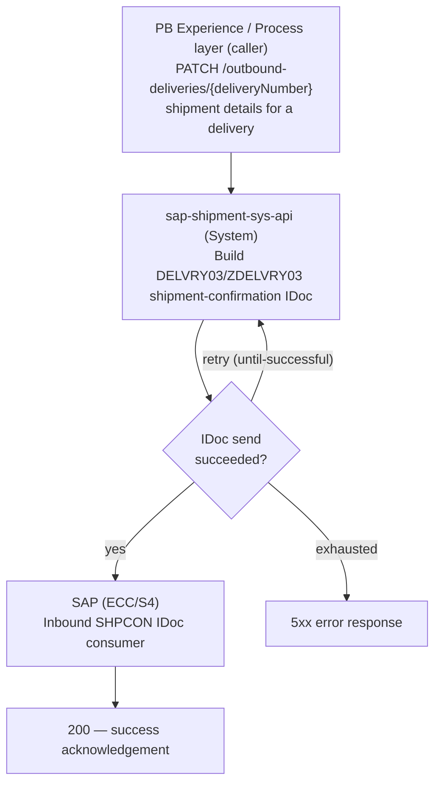

# sap-shipment-sys-api — Migration Solution Design

> Baselined on the legacy `sap-account-order-sys-api` project + notes. Migration Status in §6 is
> assessed against the already-migrated build provided in `input/migrated-api/sap-shipment-sys-api/`.
> Companion Gap Analysis: `Ref: GAP-sap-shipment-sys-api` (`sap-shipment-sys-api-gap-analysis.md`).
>
> **In-scope endpoint (Infinity scope):** `PATCH /outbound-deliveries/{deliveryNumber}`.
> All other business endpoints are listed as `Out of scope for Infinity scope`.

---

## 1. Application Overview

| Title | Description |
|---|---|
| Application Technical Name | `sap-shipment-sys-api` (migration target). Legacy baseline: `sap-account-order-sys-api`. |
| Application Business Name | SAP Shipment System API |
| Business Domain | Delivery & Shipment (Supply Chain / Logistics) — Pitney Bowes ⇄ SAP |
| Available Versions | v1 — API spec `sap-shipment-sys-api-spec:1.0.1` (`api.raml.version 1.0.1`, `app.version v1`). |
| Purpose of API | System-layer API that fronts SAP for outbound-delivery / shipment operations. **In scope for this design:** accept a shipment-details update for an outbound delivery and post it to SAP as a `DELVRY03` / `ZDELVRY03` (`SHPCON`) shipment-confirmation IDoc. |
| Mule Application Type | Mule 4 application (`mule-application`), CloudHub-deployed. Uses SAP JCo / IDoc shared libraries (`sapjco3`, `sapidoc3`, `libsapjco3`). `minMuleVersion` TBC. |
| API Type | RESTful System API (JSON over HTTPS) |
| GitHub Repo URL | TBC |
| Healthcheck Endpoints | `GET /api/ping` (implemented, liveness). `GET /api/health-check` — TBC (readiness not implemented; required by standard). |
| Exchange Specification URL | Anypoint Exchange asset `sap-shipment-sys-api-spec` (org `e0bc8c96-9dbd-48bc-915e-3e29577af6b3`), version `1.0.1` — full URL TBC. |
| Monitoring Dashboard URL | Datadog (Insulet Custom Logger). Exact dashboard URL TBC. Note: the `log4j-datadog-appender` dependency is commented out in the POM (see §6). |
| API Manager URL | TBC — autodiscovery `api.id` `20899932` (dev). |
| Runtime URLs | CloudHub (region `na`) — per-environment hostnames TBC. |
| Postman Collection File | TBC |
| Properties Configured | `properties/config.yaml` (base) + `properties/config-{env}-{region}.yaml`. Keys include HTTP port/basePath/timeout, retry attempts/interval, request timeout, logger `sensitiveKeyParts`/`safeKeys`/`encryptionKey`, `targetSystem: SAP`, SAP JCo (`sap.*`, `sap.na.*`), SAP S/4HANA OData (`sap_abap.*`), IDoc control values (`pb.shipment.idoc.*` — `idoctyp DELVRY03`, `mestyp SHPCON`, `cimtyp ZDELVRY03`, `rcvpor SAPDS4`, `rcvprn DS4CLNT210`, `mandt 210`), `reconnection.*`, `orgId`, `api.id`. |
| Azure Vault Keys and Credentials Details | Azure Key Vault properties provider. Keys observed: `global-logger-encryption-key`, `shipment-sap-password`. TLS keystore password held inline as a Secure-Properties `![...]` value (see §6). |
| Depends on Mule Apps/APIs | **Callers:** Pitney Bowes experience/process layer (`pb-exp-api` / `na-delivery-shipment-prc-api`). **Downstream:** SAP S/4HANA (OData) and SAP ECC/S4 via JCo IDoc. |
| Insulet Connectors/Libraries Used | Migrated target: Insulet Custom Logger connector (`module-logger` 1.0.2), `warehouse-mapping-library` (dw-library 1.0.0). Legacy used `common-logging-error-handling-module` + `warehouse-mapping-library`. |
| Other Libraries and Connectors Used | SAP Connector (`mule-sap-connector` 5.9.12), SAP S/4HANA Cloud Connector (`mule-sap-s4hana-cloud-connector` 2.9.0), APIKit, Secure Configuration Properties, Validation Module, HTTP Connector; SAP JCo/IDoc shared libraries. |
| API Manager Policies Applied | Client ID Enforcement via API Autodiscovery (`api-gateway:autodiscovery` present in `common/global-config.xml`). Additional policies TBC. |
| Parent-POM | Legacy: `com.mycompany:my-app:1` (placeholder — non-standard). Migrated target: `mule-common-pom:1.0.9`. |

---

## 2. Non-Functional Requirements

| Type | Description |
|---|---|
| Authentication | Client ID Enforcement via API Manager automated policy (client_id / client_secret per calling app), bound through API Autodiscovery. TLS in transit. Exact scheme TBC. |
| Response Time | TBC |
| Number of transactions to be processed | TBC |
| Spike Control | TBC |
| Rate-Limiting SLA | TBC |

---

## 3. High-Level Architecture



The API receives a shipment-details update for an outbound delivery, transforms it into an SAP
`DELVRY03` / `ZDELVRY03` (`SHPCON`) IDoc (control record populated from configuration, shipment
data from the request), and sends it to SAP through the SAP connector wrapped in a connectivity
retry (`until-successful`). On success a synchronous acknowledgement is returned to the caller.

---

## 4. Interface Specification

### Resources

| Resource Name | Supported Methods | Description |
|---|---|---|
| `/api/ping` | GET | Liveliness health check (implemented). |
| `/api/health-check` | GET | Readiness health check — TBC (not yet implemented; required by standard). |
| `/outbound-deliveries/{deliveryNumber}` | PATCH | **In scope.** Accept a shipment-details update for an outbound delivery and post it to SAP as a `DELVRY03`/`ZDELVRY03` (`SHPCON`) IDoc. |
| `/outbound-deliveries` | GET | Out of scope for Infinity scope |
| `/shipments` | POST | Out of scope for Infinity scope |
| `/shipments/status` | POST | Out of scope for Infinity scope |
| `/shipments/inventory/goodsMovement` | POST | Out of scope for Infinity scope |
| `/shipments/inventory/goodsReceipt` | POST | Out of scope for Infinity scope |
| `/shipments/inventory/kittingReceipt` | POST | Out of scope for Infinity scope |
| `/shipments/inventory/status` | POST | Out of scope for Infinity scope |

---

### 4.1 PATCH `/outbound-deliveries/{deliveryNumber}`

> **Cross-cutting (applies to this endpoint):** a request context is captured on entry
> (correlationId and business entity identifiers) and emitted through the Insulet Custom Logger at
> entry / critical-checkpoint / exit / exception tracepoints; correlationId is carried through for
> end-to-end tracing. These concerns are intentionally omitted from the diagram and mapping steps.

#### 4.1.1 Input

Path parameter: `deliveryNumber` (string, required) — the SAP outbound-delivery document number.

| Field | Type | Required? | Description |
|---|---|---|---|
| `packingSlipId` | String | Yes | Packing-slip / delivery document number; maps to the IDoc delivery document (`VBELN`). |
| `trackingId` | String | Yes | Carrier tracking number. |
| `carrierName` | String | Yes | Carrier name (e.g., FedEx, USPS). |
| `serviceUsed` | String | Yes | Shipping service (e.g., Ground, Air). |
| `shippingCost` | Number | No | Shipping cost for the shipment. |

**Example request**

```json
{
  "packingSlipId": "0080001254",
  "trackingId": "TrackingNumber1",
  "carrierName": "FedEx",
  "serviceUsed": "Ground",
  "shippingCost": 13
}
```

#### 4.1.2 Mapping (Source → Target → Transformation)

**Step 0 — Receive & set context.** Capture `correlationId` and business entity identifiers from
inbound headers, resolve `sourceSystem`/`targetSystem` from the request context, and log
"request processing started" via the Custom Logger.

**Step 1 — Build the SAP shipment-confirmation IDoc.** Transform the request into a `ZDELVRY03`
IDoc (`application/xml`). The control record (`EDI_DC40`) is populated entirely from configuration;
the delivery/shipment data is projected from the request into the delivery segments.

| Source Field/Object | Target Field/Object | Transformation Logic | Notes |
|---|---|---|---|
| `payload.packingSlipId` | `E1EDL20.VBELN` | Pass-through | Delivery / packing-slip document number. |
| `payload.trackingId` | `ZZE1EDL20.ZTRACKING_NO` | Pass-through | Custom shipment segment. |
| `payload.carrierName` | `ZZE1EDL20.ZCARRIER` | Pass-through | Custom shipment segment. |
| `payload.serviceUsed` | `ZZE1EDL20.ZSERVICE` | Pass-through | Custom shipment segment. |
| `payload.shippingCost` | `ZZE1EDL20.ZSHIPPING_COST` | Pass-through | Custom shipment segment. |
| config `pb.shipment.idoc.*` | `EDI_DC40` control record | From configuration | `TABNAM`, `MANDT`, `DIRECT`, `IDOCTYP=DELVRY03`, `CIMTYP=ZDELVRY03`, `MESTYP=SHPCON`, `SNDPOR/SNDPRT/SNDPRN`, `RCVPOR=SAPDS4`, `RCVPRT=LS`, `RCVPRN=DS4CLNT210`. |
| — (constant) | IDoc name key | Set to `DELVRY03-ZDELVRY03` | Used by the SAP send operation to select the IDoc type. |

**Step 2 — Send IDoc to SAP.** Send the IDoc through the SAP connector (NA config) wrapped in a
connectivity retry (`reconnection.attempts` / `reconnection.frequency`). The IDoc body is logged at
a critical-checkpoint tracepoint (masked).

**Step 3 — Acknowledge.** Build and return a synchronous success acknowledgement (see 4.1.3).

#### 4.1.3 Output / Acknowledgement

| Method | Success | Client Errors | Server Error |
|---|---|---|---|
| PATCH | 200 | 400, 401 | 500 |

Add **502** when the downstream SAP IDoc send cannot be completed after retries.

**Success (200) example**

```json
{
  "success": true,
  "correlationId": "a1b2c3d4-1234-5678-abcd-ef1234567890"
}
```

**Error response format (fixed — Insulet standard)**

```json
{
  "correlationId": "a1b2c3d4-1234-5678-abcd-ef1234567890",
  "errorCode": "APP:CONNECTIVITY_FAILED",
  "description": "Unable to deliver shipment IDoc to SAP.",
  "errorDetails": [
    { "message": "IDoc send failed after retries.", "code": "APP:CONNECTIVITY_FAILED" }
  ]
}
```

---

### Functional Differences (Legacy vs Migrated)

*(Behavioral deltas only — standards findings are in §6; full detail in companion Part C, `GAP-sap-shipment-sys-api`.)*

| Aspect | Legacy Behavior | Migrated Behavior | Note |
|---|---|---|---|
| Endpoint existence | Legacy `sap-account-order-sys-api` had **no** `PATCH /outbound-deliveries`; the closest shipment-to-SAP behavior posted status via OData create (`ZOTC_POD_STATUS_UPDATE_SRV`) under `POST /shipments`. | New `PATCH /outbound-deliveries/{deliveryNumber}` posts a `DELVRY03`/`ZDELVRY03` shipment-confirmation IDoc. | New capability; confirm caller contract & SAP inbound processing. |
| Integration mechanism | SAP S/4HANA OData `create-entity`. | SAP JCo **IDoc send** (`DELVRY03`/`SHPCON`). | Requires JCo/IDoc shared libs & SAP partner-profile config. |
| Success response body | `{ "status": "OK", "message": <sapResponse> }`. | `{ "success": true, "correlationId": <id> }`. | Contract change; confirm with caller. |
| Logging | Plain Mule loggers + `common-logging-error-handling-module`. | Insulet Custom Logger (`module-logger`) with masked payload + tracepoints. | Improvement; masking coverage — see §6. |
| Retry configuration | `sap.maxRetries` / `sap.msBetweenRetries` (OData). | `reconnection.attempts` / `reconnection.frequency` (IDoc send) + connector `reconnect-forever`. | Values differ; see §6 on unbounded reconnect. |

---

## 5. MUnit Coverage

> Unit-test coverage must be **80% or above** (per suite and overall). All external calls (HTTP,
> Salesforce, MQ, DB) must be mocked, with one test suite per flow file.

---

## 6. Standards Compliance & Migration Status

> Migration Status is assessed against the migrated build in `input/migrated-api/sap-shipment-sys-api/`.
> `✓ Done` items need no further action; `◐` / `✗` items carry remediation. The legacy-vs-migrated
> comparison is folded into these per-finding statuses (behavioral deltas are in §4 / companion Part C).
> Gold-standard System-layer reference: `sfl-consents-sys-api`.

### 6.1 API/error handling not wired to a standard error envelope (CRITICAL)
- **Standard:** `review-error-handling`, `review-api-design-standards`
- **Severity:** CRITICAL
- **Legacy Baseline:** The legacy main flow declared per-type APIKit error responses (400/404/405/406/415/501) and a common handler that mapped SAP/validation errors to HTTP 422 with a `{ code, message, egReason }` body.
- **Migration Status:** `◐ Partially migrated` — the migrated main flow's global error handler is commented out (`<!-- <error-handler ref="global-error-handler" /> -->`) and declares **no** APIKit client-error handlers, so malformed requests / unknown resources fall through to the default handler (HTTP 500). The in-scope PATCH flow's own handler catches `ANY`, logs, and returns a non-standard `{ description, code, message }` body **without setting `httpStatus`** (so failures surface as 500). A `common/global-error-handler.xml` (using the `module-error-handler-plugin` + `errors/customErrors.dwl`) exists but is not referenced by the main flow.
- **Remediation:**
  1. Wire `common/global-error-handler.xml` (`module-error-handler-plugin:process-error` with `errors/customErrors.dwl`) to the main flow, as in the gold-standard `sfl-consents-sys-api`.
  2. Restore explicit APIKit client-error handling (BAD_REQUEST, NOT_FOUND, METHOD_NOT_ALLOWED, NOT_ACCEPTABLE, UNSUPPORTED_MEDIA_TYPE, NOT_IMPLEMENTED).
  3. Emit the fixed Insulet error envelope (`correlationId`/`errorCode`/`description`/`errorDetails`) and set `httpStatus` correctly: 400 (bad request/validation), 401 (auth), 500 (internal), 502 (`APP:CONNECTIVITY_FAILED` on IDoc send failure).

### 6.2 Datadog monitoring appender disabled (MAJOR)
- **Standard:** `review-logging-standards`, `review-pom-maven-standards`
- **Severity:** MAJOR
- **Legacy Baseline:** N/A (legacy relied on the common logging module / CloudHub logs).
- **Migration Status:** `✗ Not yet migrated` — the `log4j-datadog-appender` dependency is commented out in the POM, so structured logs are not shipped to the Datadog monitoring dashboard referenced in §1.
- **Remediation:**
  1. Re-enable the `log4j-datadog-appender` dependency and configure the Datadog `AsyncLogger` appenders in `log4j2.xml` (categories for general / masked / encrypted payloads) per the System-layer reference API.
  2. Verify logs reach the Datadog service/dashboard for `sap-shipment-sys-api`.

### 6.3 Readiness health check missing (MAJOR)
- **Standard:** `review-api-design-standards`
- **Severity:** MAJOR
- **Legacy Baseline:** Only `GET /ping` implemented.
- **Migration Status:** `✗ Not yet migrated` — only `/ping` (liveness) is present; `/health-check` (readiness) is missing.
- **Remediation:**
  1. Add `GET /api/health-check` using the readiness-probe pattern from the common library / reference System API.

### 6.4 Payload masking coverage not verified for shipment fields (MAJOR)
- **Standard:** `review-security-standards`, `review-logging-standards`
- **Severity:** MAJOR
- **Legacy Baseline:** Raw payloads were logged at DEBUG with a `maskJson` helper keyed on `log.maskedfields` (set to a `['dummy']` placeholder).
- **Migration Status:** `◐ Partially migrated` — the Custom Logger masked-payload operation logs the full IDoc body at a critical checkpoint; `logger.sensitiveKeyParts` covers generic PII (`ssn`, `password`, `email`, …) but not shipment/IDoc field fragments (`ZTRACKING_NO`, `trackingId`, `VBELN`).
- **Remediation:**
  1. Extend `sensitiveKeyParts` with shipment/tracking fragments as required by data-classification, and confirm masking on the IDoc body with a masked-payload log test.
  2. Keep `encryptionKey` vault-sourced (already referenced) — never inline.

### 6.5 Project / Exchange documentation not project-specific (MINOR)
- **Standard:** `review-pom-maven-standards`, `review-api-design-standards`
- **Severity:** MINOR
- **Legacy Baseline:** N/A.
- **Migration Status:** `✗ Not yet migrated` — the POM `description` is the boilerplate "This is the Mule api template project"; README/Exchange/Confluence links not project-specific.
- **Remediation:**
  1. Replace the POM description and README with project-specific content (purpose, in-scope endpoint, Confluence LLD link, Exchange asset link, owner).

### 6.6 TLS keystore password stored inline (MINOR)
- **Standard:** `review-security-standards`, `review-properties-config`
- **Severity:** MINOR
- **Legacy Baseline:** TLS keystore password was an encrypted Secure-Properties `![...]` value.
- **Migration Status:** `◐ Partially migrated` — SAP and logger secrets are correctly sourced from Azure Key Vault, but the TLS keystore password remains an inline `![...]` value in `config-{env}-{region}.yaml`.
- **Remediation:**
  1. Move the TLS keystore password to Azure Key Vault (as with the SAP password / logger key).

### 6.7 SAP connections use unbounded reconnect-forever (MINOR)
- **Standard:** `review-mule-global-config`, `review-error-handling`
- **Severity:** MINOR
- **Legacy Baseline:** SAP S/4HANA config used `reconnect-forever` (no bound).
- **Migration Status:** `◐ Partially migrated` — the migrated SAP JCo and S/4HANA configs still use `reconnect-forever`; unbounded reconnect can mask outages and delay error surfacing.
- **Remediation:**
  1. Adopt a bounded `reconnect` (count + frequency) consistent with the reference System API, so transient failures surface as `APP:CONNECTIVITY_FAILED` → HTTP 502.

### 6.8 Secrets sourced from Azure Key Vault (MAJOR)
- **Standard:** `review-security-standards`
- **Severity:** MAJOR
- **Legacy Baseline:** Secrets were encrypted `![...]` Secure-Properties values with a runtime key.
- **Migration Status:** `✓ Done — already migrated, no pending work` — SAP password and logger encryption key resolve via `azure-key-vault-properties-provider` (except the TLS keystore password — tracked in 6.6).

### 6.9 API Autodiscovery / Client ID Enforcement wired (MAJOR)
- **Standard:** `review-mule-global-config`, `review-security-standards`
- **Severity:** MAJOR
- **Legacy Baseline:** `api-gateway:autodiscovery` bound the main flow to API Manager.
- **Migration Status:** `✓ Done — already migrated, no pending work` — `api-gateway:autodiscovery` (with `api.id`) is present in `common/global-config.xml` and references the main flow.

### 6.10 Custom Logger & standard parent POM adopted (MINOR)
- **Standard:** `review-logging-standards`, `review-pom-maven-standards`
- **Severity:** MINOR
- **Legacy Baseline:** `common-logging-error-handling-module` + placeholder parent `com.mycompany:my-app:1`.
- **Migration Status:** `✓ Done — already migrated, no pending work` — the Insulet Custom Logger connector is used across flows and the project inherits `mule-common-pom:1.0.9`.

**Findings summary:** CRITICAL 1 · MAJOR 5 · MINOR 4 (3 findings are `✓ Done`).
