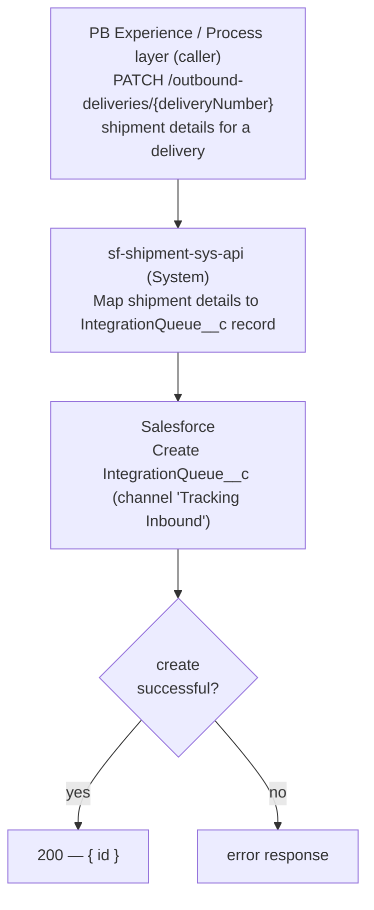

# sf-shipment-sys-api — Migration Solution Design

> Baselined on the legacy `sf-na-sys-api` project + notes. Migration Status in §6 is assessed
> against the already-migrated build provided in `input/migrated-api/sf-shipment-sys-api/`.
> Companion Gap Analysis: `Ref: GAP-sf-shipment-sys-api` (`sf-shipment-sys-api-gap-analysis.md`).
>
> **In-scope endpoint (Infinity scope):** `PATCH /outbound-deliveries/{deliveryNumber}`.
> All other business endpoints are listed as `Out of scope for Infinity scope`.

---

## 1. Application Overview

| Title | Description |
|---|---|
| Application Technical Name | `sf-shipment-sys-api` (migration target). Legacy baseline: `sf-na-sys-api`. |
| Application Business Name | Salesforce Shipment System API |
| Business Domain | Delivery & Shipment (Supply Chain / Logistics) — Pitney Bowes ⇄ Salesforce |
| Available Versions | v1 — API spec `sf-shipment-sys-api-spec:1.0.0` (`api.raml.version 1.0.0`, `app.version` from `${app.version}`). |
| Purpose of API | System-layer API that fronts Salesforce for shipment operations. **In scope for this design:** accept a shipment-details update for an outbound delivery and create a Salesforce `IntegrationQueue__c` record (channel "Tracking Inbound") for downstream processing. |
| Mule Application Type | Mule 4 application (`mule-application`), CloudHub-deployed. `tag: System`. `minMuleVersion` TBC. |
| API Type | RESTful System API (JSON over HTTPS) |
| GitHub Repo URL | TBC |
| Healthcheck Endpoints | `GET /api/ping` (implemented, liveness). `GET /api/health-check` — TBC (readiness not implemented; required by standard). |
| Exchange Specification URL | Anypoint Exchange asset `sf-shipment-sys-api-spec` (org `e0bc8c96-9dbd-48bc-915e-3e29577af6b3`), version `1.0.0` — full URL TBC. |
| Monitoring Dashboard URL | Datadog (Insulet Custom Logger). Exact dashboard URL TBC. |
| API Manager URL | TBC — autodiscovery `api.id` `20853215` (dev). |
| Runtime URLs | CloudHub (region `na`) — per-environment hostnames TBC. |
| Postman Collection File | TBC |
| Properties Configured | `properties/config.yaml` (base) + `properties/config-{env}-{region}.yaml`. Keys include HTTP port/timeout, retry attempts/interval, request timeout (`5000`), logger `category`/`sensitive.fields`/`safe.keys`/`encryption.key`, `target: SFDC`, Salesforce JWT (`salesforce.keystore`/`alias`/`tokenEndpoint`/`audienceUrl`/`principal`/`consumerKey`/`storePassword`/`readTimeout`/`composite.responsetimeout`), `salesforce.pb.shipmentdetails.channel: "Tracking Inbound"`, `server.host/basePath/port`, `orgId`, `api.id`. |
| Azure Vault Keys and Credentials Details | Azure Key Vault properties provider. Keys observed: `global-logger-encryption-key`, `na-shipment-sf-store-password`, `na-shipment-sf-consumer-key`. TLS keystore password held inline as a Secure-Properties `![...]` value (see §6). |
| Depends on Mule Apps/APIs | **Callers:** Pitney Bowes experience/process layer (`pb-exp-api` / `na-delivery-shipment-prc-api`). **Downstream:** Salesforce (Salesforce Connector + Salesforce Composite Connector). |
| Insulet Connectors/Libraries Used | Migrated target: Insulet Custom Logger connector (`module-logger`) — **dependency currently commented out in the POM** though referenced by config (see §6). Legacy used `common-logging-error-handling-module`. |
| Other Libraries and Connectors Used | Salesforce Connector, Salesforce Composite Connector, APIKit, Object Store Connector, Validation Module, Secure Configuration Properties, HTTP Connector, Sockets. |
| API Manager Policies Applied | Client ID Enforcement via API Autodiscovery (`api-gateway:autodiscovery` present in `common/global-config.xml`). Additional policies TBC. |
| Parent-POM | Legacy: `com.mycompany:my-app:1` (placeholder — non-standard). Migrated target: `mule-common-pom:1.0.13`. |

---

## 2. Non-Functional Requirements

| Type | Description |
|---|---|
| Authentication | Client ID Enforcement via API Manager automated policy (client_id / client_secret per calling app), bound through API Autodiscovery. TLS in transit; Salesforce via OAuth 2.0 JWT bearer. Exact scheme TBC. |
| Response Time | TBC |
| Number of transactions to be processed | TBC |
| Spike Control | TBC |
| Rate-Limiting SLA | TBC |

---

## 3. High-Level Architecture



The API receives a shipment-details update for an outbound delivery, maps it to a Salesforce
`IntegrationQueue__c` record (channel sourced from configuration), creates the record via the
Salesforce connector, validates the create succeeded, and returns the created record id to the
caller.

---

## 4. Interface Specification

### Resources

| Resource Name | Supported Methods | Description |
|---|---|---|
| `/api/ping` | GET | Liveliness health check (implemented). |
| `/api/health-check` | GET | Readiness health check — TBC (not yet implemented; required by standard). |
| `/outbound-deliveries/{deliveryNumber}` | PATCH | **In scope.** Accept a shipment-details update for an outbound delivery and create a Salesforce `IntegrationQueue__c` record. |
| `/shipments` | POST | Out of scope for Infinity scope |
| `/shipments` | GET | Out of scope for Infinity scope |
| `/shipments/{id}` | PATCH | Out of scope for Infinity scope |

---

### 4.1 PATCH `/outbound-deliveries/{deliveryNumber}`

> **Cross-cutting (applies to this endpoint):** a request context is captured on entry
> (correlationId and business entity identifiers) and emitted through the Insulet Custom Logger at
> entry / exit / exception tracepoints; correlationId is carried through for end-to-end tracing.
> These concerns are intentionally omitted from the diagram and mapping steps.

#### 4.1.1 Input

Path parameter: `deliveryNumber` (string, required) — the SAP outbound-delivery document number.

| Field | Type | Required? | Description |
|---|---|---|---|
| `salesOrderNr` | String | Yes | Sales order the shipment belongs to. |
| `trackingId` | String | Yes | Carrier tracking number. |
| `carrierName` | String | Yes | Carrier name (e.g., FedEx, USPS). |
| `addressString` | String | Yes | Ship-to address as a single string (PII — must be masked in logs, see §6). |

**Example request**

```json
{
  "salesOrderNr": "110002222",
  "trackingId": "TrackingNumber1",
  "carrierName": "FedEx",
  "addressString": "21106 Park Brook Dr, Katy, TX, 77450, US"
}
```

#### 4.1.2 Mapping (Source → Target → Transformation)

**Step 0 — Receive & set context.** Capture `correlationId` and business entity identifiers from
inbound headers, resolve `sourceSystem`/`targetSystem` from the request context, and log
"request processing started" via the Custom Logger.

**Step 1 — Build the Salesforce record.** Map the request to a Salesforce `IntegrationQueue__c`
record:

| Source Field/Object | Target Field/Object | Transformation Logic | Notes |
|---|---|---|---|
| config `salesforce.pb.shipmentdetails.channel` | `Channel__c` | Constant from configuration | Value `"Tracking Inbound"`. |
| `payload.salesOrderNr` | `SO_Number__c` | Pass-through | Sales order number. |
| `payload.trackingId` | `TrackingNumber__c` | Pass-through | Carrier tracking number. |
| `payload.carrierName` | `CarrierUsed__c` | Pass-through | Carrier name. |
| `payload.addressString` | `ShippingLabel__c` | Pass-through | Ship-to address (PII — mask in logs, see §6). |

**Step 2 — Create in Salesforce.** Create the `IntegrationQueue__c` record through the Salesforce
connector (NA config), then validate the create was successful; a non-successful create is raised as
an error (see 4.1.3).

**Step 3 — Acknowledge.** Return the created record id (see 4.1.3).

#### 4.1.3 Output / Acknowledgement

| Method | Success | Client Errors | Server Error |
|---|---|---|---|
| PATCH | 200 | 400, 401 | 500 |

Add **502** when the downstream Salesforce create fails.

**Success (200) example**

```json
{
  "id": "a1XVA000000abcd2AA"
}
```

**Error response format (fixed — Insulet standard)**

```json
{
  "correlationId": "a1b2c3d4-1234-5678-abcd-ef1234567890",
  "errorCode": "SALESFORCE:CONNECTIVITY",
  "description": "Salesforce create resulted in errors.",
  "errorDetails": [
    { "message": "IntegrationQueue__c create was not successful.", "code": "VALIDATION:INVALID_BOOLEAN" }
  ]
}
```

---

### Functional Differences (Legacy vs Migrated)

*(Behavioral deltas only — standards findings are in §6; full detail in companion Part C, `GAP-sf-shipment-sys-api`.)*

| Aspect | Legacy Behavior | Migrated Behavior | Note |
|---|---|---|---|
| Request field names | `salesOrderNumber`, `trackingNumber`, `carrierUsed`, `addressString` | `salesOrderNr`, `trackingId`, `carrierName`, `addressString` | Contract change — caller must send the new names. |
| Channel property | `sf.pb.shipmentdetails.channel` (`"Tracking Inbound"`) | `salesforce.pb.shipmentdetails.channel` (`"Tracking Inbound"`) | Same value, renamed key. |
| Salesforce config | `Salesforce_Config` | `Salesforce_Config_NA` | Region-specific config. |
| Target mapping | `IntegrationQueue__c` { Channel__c, SO_Number__c, TrackingNumber__c, CarrierUsed__c, ShippingLabel__c } | Identical target fields | No change to Salesforce object mapping. |
| Logging | Common logging module (event received / processed) | Insulet Custom Logger (masked payload) + tracepoints | Improvement; masking coverage — see §6. |
| Error handling | `common-logging-error-handling-module` set-error-response flow | `na-common-error-handler` (JSON→java body, no `httpStatus` set → 500) | Non-standard envelope — see §6. |
| Success response | `{ id }` | `{ id }` | Unchanged. |

---

## 5. MUnit Coverage

> Unit-test coverage must be **80% or above** (per suite and overall). All external calls (HTTP,
> Salesforce, MQ, DB) must be mocked, with one test suite per flow file.

---

## 6. Standards Compliance & Migration Status

> Migration Status is assessed against the migrated build in `input/migrated-api/sf-shipment-sys-api/`.
> `✓ Done` items need no further action; `◐` / `✗` items carry remediation. The legacy-vs-migrated
> comparison is folded into these per-finding statuses (behavioral deltas are in §4 / companion Part C).
> Gold-standard System-layer reference: `sfl-consents-sys-api`.

### 6.1 Sensitive-payload masking is not effective (CRITICAL)
- **Standard:** `review-security-standards`, `review-logging-standards`
- **Severity:** CRITICAL
- **Legacy Baseline:** Payloads were logged via the common logging module; masking keyed on a `['dummy']` placeholder — effectively unmasked.
- **Migration Status:** `◐ Partially migrated` — the Custom Logger masked-payload operation is used on the PATCH flow, but `logger.sensitive.fields` is `["name"]` only, so PII such as `addressString` (`ShippingLabel__c`) and `trackingId` are not masked.
- **Remediation:**
  1. Populate `sensitive.fields` with PII fragments (e.g., `address,addressString,shippingLabel,phone,postalCode,name,trackingNumber,trackingId`).
  2. Keep `safe.keys` for false positives; verify masking with a masked-payload log test.
  3. Ensure `encryption.key` remains vault-sourced (already referenced) — never inline.

### 6.2 Custom Logger connector dependency commented out (MAJOR)
- **Standard:** `review-pom-maven-standards`, `review-logging-standards`
- **Severity:** MAJOR
- **Legacy Baseline:** N/A (legacy used the common logging module).
- **Migration Status:** `◐ Partially migrated` — flows and `common/global-config.xml` reference `custom-logger-connector-config` (`module-logger`), but the `mule-custom-logger-connector` dependency is commented out in the POM, risking build/runtime resolution failures.
- **Remediation:**
  1. Restore the `mule-custom-logger-connector` dependency in the POM (as in the reference System API), and confirm the version matches the `custom-logger-connector-config` in use.

### 6.3 Standard error envelope & HTTP status mapping not implemented (MAJOR)
- **Standard:** `review-error-handling`, `review-api-design-standards`
- **Severity:** MAJOR
- **Legacy Baseline:** The common logging module produced a standardized error response; the main flow declared APIKit per-type client-error handlers.
- **Migration Status:** `◐ Partially migrated` — the in-scope PATCH flow references `na-common-error-handler`, which logs and returns a `{ description, type, message }` body as `application/java` **without setting `httpStatus`** (failures surface as 500). A `common/global-error-handler.xml` (with `module-error-handler-plugin` + `errors/customErrors.dwl`) exists but is not wired to this endpoint, and the richer status-mapping sub-flow (`emea-common-log-error-subflow`) is unused on the NA path.
- **Remediation:**
  1. Wire the endpoint to `common/global-error-handler.xml` (`process-error` + `errors/customErrors.dwl`) as in the gold-standard `sfl-consents-sys-api`.
  2. Emit the fixed Insulet error envelope (`correlationId`/`errorCode`/`description`/`errorDetails`) as `application/json`, and set `httpStatus`: 400 (bad request/validation), 401 (auth), 500 (internal), 502 (`SALESFORCE:CONNECTIVITY` / downstream create failure).
  3. Retain explicit APIKit client-error handling on the main flow.

### 6.4 Readiness health check missing (MAJOR)
- **Standard:** `review-api-design-standards`
- **Severity:** MAJOR
- **Legacy Baseline:** Only `GET /ping` implemented.
- **Migration Status:** `✗ Not yet migrated` — only `/ping` (liveness) is present; `/health-check` (readiness) is missing.
- **Remediation:**
  1. Add `GET /api/health-check` using the readiness-probe pattern from the common library / reference System API.

### 6.5 Project / Exchange documentation not project-specific (MINOR)
- **Standard:** `review-pom-maven-standards`, `review-api-design-standards`
- **Severity:** MINOR
- **Legacy Baseline:** N/A.
- **Migration Status:** `✗ Not yet migrated` — the POM `description` is the boilerplate "This is the Mule api template project"; README/Exchange/Confluence links not project-specific.
- **Remediation:**
  1. Replace the POM description and README with project-specific content (purpose, in-scope endpoint, Confluence LLD link, Exchange asset link, owner).

### 6.6 TLS keystore password stored inline (MINOR)
- **Standard:** `review-security-standards`, `review-properties-config`
- **Severity:** MINOR
- **Legacy Baseline:** TLS keystore password was an encrypted Secure-Properties `![...]` value.
- **Migration Status:** `◐ Partially migrated` — Salesforce and logger secrets are correctly sourced from Azure Key Vault, but the TLS keystore password remains an inline `![...]` value in `config-{env}-{region}.yaml`.
- **Remediation:**
  1. Move the TLS keystore password to Azure Key Vault (as with the Salesforce consumer key / store password / logger key).

### 6.7 Secrets sourced from Azure Key Vault (MAJOR)
- **Standard:** `review-security-standards`
- **Severity:** MAJOR
- **Legacy Baseline:** Salesforce secrets were encrypted `![...]` Secure-Properties values with a runtime key.
- **Migration Status:** `✓ Done — already migrated, no pending work` — Salesforce consumer key, store password, and logger encryption key resolve via `azure-key-vault-properties-provider` (except the TLS keystore password — tracked in 6.6).

### 6.8 API Autodiscovery / Client ID Enforcement wired (MAJOR)
- **Standard:** `review-mule-global-config`, `review-security-standards`
- **Severity:** MAJOR
- **Legacy Baseline:** `api-gateway:autodiscovery` was commented out in the legacy `sf-na-sys-api` global config.
- **Migration Status:** `✓ Done — already migrated, no pending work` — `api-gateway:autodiscovery` (with `api.id`) is present in `common/global-config.xml` and references the main flow.

### 6.9 Downstream create resilience — validation without typed error mapping (MINOR)
- **Standard:** `review-error-handling`
- **Severity:** MINOR
- **Legacy Baseline:** The create sub-flow validated `successful` and appended SFDC error context.
- **Migration Status:** `◐ Partially migrated` — the migrated create sub-flow validates `successful` and logs SFDC error detail, but connectivity/timeout errors are not distinctly mapped to a 502 (they fall to the generic `na-common-error-handler` → 500).
- **Remediation:**
  1. Map Salesforce connectivity/timeout error types to 502 with `SALESFORCE:CONNECTIVITY`, per §6.3 and the reference System API.

### 6.10 Custom Logger & standard parent POM adopted (MINOR)
- **Standard:** `review-logging-standards`, `review-pom-maven-standards`
- **Severity:** MINOR
- **Legacy Baseline:** `common-logging-error-handling-module` + placeholder parent `com.mycompany:my-app:1`.
- **Migration Status:** `◐ Partially migrated` — the Custom Logger pattern and `mule-common-pom:1.0.13` parent are adopted, but the logger connector dependency is commented out (see 6.2 — resolve there).

**Findings summary:** CRITICAL 1 · MAJOR 5 · MINOR 4 (2 findings are `✓ Done`).
