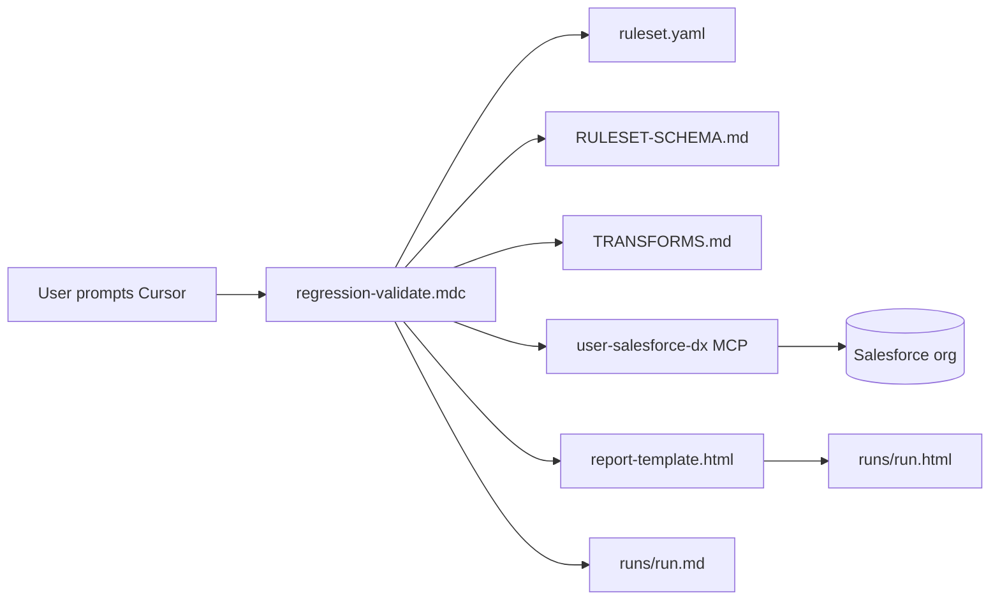
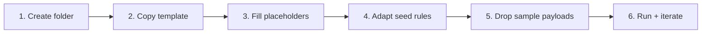

# Generic Salesforce Regression Harness — Templates

This folder is the canonical template library for the Salesforce regression
harness. It lives inside the regression agent at `agents/regression/templates/`
so that all harness assets are version-controlled alongside the agent rules
that use them.

## What you get

| File | What it is | Where it ultimately belongs |
|---|---|---|
| [`regression-validate.mdc`](regression-validate.mdc) | Cursor rule (the generic SF runner). Parameterised on `ruleset_path`. | Copy to `.cursor/rules/regression-validate.mdc` to activate. |
| [`ruleset.yaml`](ruleset.yaml) | Template ruleset with 6 commented seed rules covering the common patterns. | Used as seed by `sf-validation-from-postman.mdc`; also copy to `regression-tooling/<your-api-name>/ruleset.yaml` when onboarding manually. |
| [`report-template.html`](report-template.html) | Self-contained HTML skeleton (inline CSS + SVG charts, `{{TOKEN}}` placeholders) for rendering SF regression run reports. | Read at report-generation time by the runner; never copied — always referenced in-place. |
| `README.md` (this file) | The onboarding guide you're reading. | Stays here as the reference. |

The harness re-uses two API-agnostic assets that live under
[`regression-tooling/`](../../regression-tooling/) — there is **no need to
duplicate** them:

- [`regression-tooling/RULESET-SCHEMA.md`](../../regression-tooling/RULESET-SCHEMA.md) — full grammar.
- [`regression-tooling/TRANSFORMS.md`](../../regression-tooling/TRANSFORMS.md) — pipe-filter reference.

## How the harness works



The runner walks the rules in topological order (via `depends_on:`),
renders each rule's SOQL by substituting `{{ payload.X }}` /
`{{ captures.X.Y }}` / `{{ consts.X }}` / `{{ context.X }}` templates,
calls the `user-salesforce-dx` MCP server's `run_soql_query` tool, then
applies the rule's `expect.record_count` and `expect.fields` assertions.
Every rule's outcome is one of: `PASS`, `FAIL_FIELDS`, `FAIL_RECORD_COUNT`,
`FAIL_MISSING_CAPTURE`, `FAIL_SOQL`, `FAIL_UNEXPECTED_RECORDS`,
`SKIPPED_GATE`, `SKIPPED_OPTIONAL`.

Reports persist under `project/output_regression/<ruleset.name>-sf-validation/` as
sibling Markdown + HTML files. No pass-rate percentage anywhere.

## Automated onboarding via `sf-validation-from-postman.mdc`

The preferred way to onboard a new API is to run the Postman regression first
and then answer **yes** to the SF validation prompt. The agent
(`agents/regression/rules/sf-validation-from-postman.mdc`) will:

1. Parse the Newman JSON output and extract request/response pairs as sample files.
2. Analyse the Mule codebase (DWL + XML) to understand SF write operations.
3. Generate `regression-tooling/<api-name>/ruleset.yaml` seeded from `ruleset.yaml` here.
4. Generate `regression-tooling/<api-name>/samples/*.json` from the Newman output.
5. Trigger the SF regression runner for each selected sample.

Final output lands in:
```
regression-tooling/
└── <api-name>/
    ├── ruleset.yaml          ← generated; review before re-running
    ├── samples/*.json        ← generated from Newman output
    └── runs/
        ├── <run-id>-<sample>.md    ← full markdown report
        └── <run-id>-<sample>.html  ← HTML report from report-template.html
```

## Manual onboarding in 6 steps



### 1. Create the folder layout

```
regression-tooling/
  <your-api-name>/
    ruleset.yaml          # this API's rules
    samples/              # one .json per representative payload
    runs/                 # generated by the runner; gitignored or curated
```

### 2. Copy the template

```bash
cp agents/regression/templates/ruleset.yaml regression-tooling/<your-api-name>/ruleset.yaml
```

### 3. Fill the placeholders

At the top of the new `ruleset.yaml`:

- `ruleset.name` — e.g. `na-orders-proc-api`. Must match the folder name
  (the runner derives the report-output path from this).
- `ruleset.api_version` — Salesforce REST API version (e.g. `v62.0`).
- `ruleset.default_org_alias` — the default `sf org` alias the runner
  queries against (e.g. `insulet-devint2`). Can be overridden per-run.
- `ruleset.consts` — one entry per Mule-hardcoded literal. Mirror your
  Mule app's `src/main/resources/properties/config.properties` so rule
  bodies stay payload-driven.

### 4. Adapt the seed rules

The template ships with 6 commented patterns. Use the cheat sheet below
to decide which to keep, adapt, or delete:

| Pattern in template | When to use it | Real-world example |
|---|---|---|
| `account-primary` (Pattern 1) | Required record with a stable match key. All fields strict-equal. | Account, Lead, OrderHeader. |
| `contact-point-phone` (Pattern 2) | A record only created when an optional payload key is present; some of its fields are themselves conditional. | ContactPointPhone, OrderItem with optional discount fields. |
| `account-provider` (Pattern 3) | A read-only lookup whose target may or may not exist; absence is legitimate. | Provider Account, Practice Account, Distributor lookup. |
| `member-plan` (Pattern 4) | The Mule app's match strategy depends on which payload keys are populated — fallback lookup needed. | MemberPlan with vs. without SourceID; Order with vs. without ParentOrderId. |
| `account-picklist-fields` (Pattern 5) | Field whose value Salesforce case-normalises on save. Avoid false-FAIL. | `PersonGender`, restricted picklists, `Status` enums. |
| `integration-error-absence` (Pattern 6) | "X must NOT exist" post-condition. Usually pairs with `context.since_iso`. | `Integration_Error__c`, audit-only absence checks. |

The general principle: **one rule per Salesforce object that the Mule app
upserts/creates**. Bundle related field assertions into the rule for that
object rather than spreading them across multiple rules.

### 5. Drop sample payload JSONs

Put one or more representative payload JSONs under
`regression-tooling/<your-api-name>/samples/`. The runner accepts either:

- An inline JSON block you paste into the chat, or
- A filename it can resolve under `samples/` (e.g. `patient-lead.json`).

### 6. Run it

#### Option A — invoke the generic runner directly

Make sure the runner is active in Cursor: copy
`agents/regression/templates/regression-validate.mdc` to
`.cursor/rules/regression-validate.mdc`. Then prompt Cursor with any of
these (the `<api-name>` is what makes the generic runner pick up):

> "validate this payload against salesforce for **na-orders-proc-api**"
>
> "regression test **na-orders-proc-api** against insulet-devint2"
>
> "verify SF records for payload `samples/order-001.json` using ruleset `regression-tooling/na-orders-proc-api/ruleset.yaml`"

#### Option B — ship a thin API-specific wrapper

If your team wants a single trigger phrase tailored to your API (no need
to name it every time), drop a tiny rule file at
`.cursor/rules/regression-validate-<api-name>.mdc` whose
`description:` lists your preferred trigger phrases and whose body says
*"hardcoded `ruleset_path = regression-tooling/<api-name>/ruleset.yaml`,
delegate to the procedure in
[`.cursor/rules/regression-validate.mdc`](mdc:.cursor/rules/regression-validate.mdc)"*.

## Authoring conventions

- **Cite your sources.** Every rule's `cites:` block should reference the
  DWL line range or XML block the assertion derives from. When the Mule
  mapping changes, the rule and its citation are updated together.
- **Match on the Mule app's read predicates, not whatever's convenient.**
  Your `lookup.soql.WHERE` should mirror the SOQL in
  `p-set-*-queries.dwl` (or equivalent) so the regression check replays
  the same join the app uses.
- **Use `consts:` for literals.** Anything Mule writes verbatim (RecordType
  names, IdUsageType labels, default StageNames, etc.) belongs in
  `ruleset.consts`.
- **Layer your rules.** Independent lookups (Layer 0) capture root entities;
  dependent rules (Layer 1+) reference those captures via `depends_on:`.
- **Don't auto-fix.** If the runner detects a systematic mismatch, surface
  it as a `FAIL_SOQL` finding and suggest the change — never edit
  `ruleset.yaml` automatically.

## Pre-flight checklist before the first run

- [ ] `ruleset.name` matches the folder name under `regression-tooling/`.
- [ ] Every `depends_on:` entry references a known `rule.id` in the same file.
- [ ] Every `captures.X.Y` template reference has a matching upstream
      `capture_as: X` in a rule with an earlier `depends_on` level.
- [ ] Every `consts.X` template reference has a matching entry in
      `ruleset.consts`.
- [ ] Every rule has a non-empty `cites:` block pointing at the Mule source.
- [ ] Sensitive payload fields (PII, PHI) are sanitised in any sample
      JSON committed under `samples/`.

## Canonical example

The Drupal EXP API harness under
[`regression-tooling/na-drupal-exp-api/ruleset.yaml`](../../regression-tooling/na-drupal-exp-api/ruleset.yaml)
is the canonical worked example. Use it as a reference when you're stuck.
